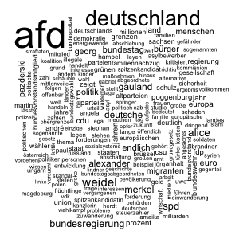

\pagebreak
\tableofcontents
\pagebreak

\listoftables
\pagebreak

\listoffigures
\pagebreak

```{r, setup, include=FALSE}
rm(list = ls())
# chunk option defaults
knitr::opts_chunk$set(echo = FALSE, message = FALSE, warning = FALSE, fig.align = 'center')

# packages
library(tidyr)
library(tidytext)
library(dplyr)
library(ggridges)
library(ggplot2)
library(ggrepel)
library(stargazer)
library(kableExtra)
library(ggthemes)
library(readr)
library(stringr)
library(patchwork)
library(stm)
library(magrittr)
library(scales)

# Set globals
election_date <- as.Date('2017-09-24')
max_date <- as.Date('2018-02-13')
parties <- c("AfD","CDU/CSU","FDP","B90/GRÜNE","DIE LINKE","SPD")

load("../output/models/model40_weekly_source.Rda")
model_df <- model_df %>%
  dplyr::mutate(
    doc_index = as.numeric(rownames(.)),
    election_dummy = as.factor(ifelse(date <= election_date, "pre election", "post election")),
    year_week = lubridate::floor_date(date, "1 week")
  )
# functions
source("../docs/func/functions.R")

custom_colors <- c(
  # news articles
  'DIE WELT'='#1b9e77','stern.de'='#d95f02','Handelsblatt'='#7570b3',
  'FOCUS Online'='#a6761d','SPIEGEL ONLINE'='#66a61e','ZEIT ONLINE'='#e6ab02',
  'Bild.de'='#e7298a',
  # parties
  "AfD"="#009ee0","CDU"="#32302e","CDU/CSU"="#32302e","FDP"="#ffed00",
  "B90/GRÜNE"="#46962b","DIE LINKE"="#ec008c","SPD"="#E3000F")

theme_set(theme_bw(base_size=10))
theme_update(axis.text = element_text(size = 8),
             axis.title = element_text(size= 10),
             strip.text = element_text(size=6))
```

# 1 Introduction
In democracies, the media fulfill fundamental functions: They should inform the people, contribute to the formation of opinion through criticism and discussion and thus enable participation. In recent decades, however, concern has grown about the role of media in politics in general and in election campaigns in particular. They are criticized for influencing election results through their reporting and for helping populist parties in particular to flourish. After the 2017 federal elections in Germany, for example, the media were accused of contributing to the success of the right-wing populist AfD by increasingly including the party's content and using the same language in their articles as the AfD. On the other hand, supporters of the AfD accuse the media of not covering their topics to a sufficient extent. Representatives of these media houses strongly opposed both accusations, claiming balanced reporting. The purpose of this study is to examine whether there is evidence that supports the allegation of biased media reporting in either direction, especially during election campaigns.

<!-- What drives bias? -->
Economic literature examines both the supply and demand sides as factors driving media bias. In the former case, bias reflects the preferences of editors, owners [@besley_handcuffs_2006], or journalists [@baron_persistent_2006]. On the other hand, bias may be driven by the demand side reflecting the profit-maximizing decision of news providers to satisfy consumer preferences. Advertising-financed media like online news, which offer their content to a large extent free of charge and generate revenue through advertising space, compete for readers' attention. Readers pay a non-monetary price providing their attention, which the media platform bundles and sells to advertising customers. This business model corresponds to that of a platform market. News outlets act as platforms that connect the advertising market with the reader market to exploit the indirect network effects between them [@dewenter_einfuhrung_2014]. Therefore, a profit-maximizing publisher directs its economic decisions according to what will attract the most attention. In the traditional conception of the demand for news, where readers value the accuracy of the information, the market forces news outlets to deliver more accurate information. @gentzkow_media_2006 showed that increased competition among newspapers can reduce bias. Their setup assumes that newspapers want to build a reputation as providers of accurate information and that bayesian consumers base their beliefs about information quality on past reports. As a result, low-quality firms are incentivized to ignore signals that contradict prior common expectations. Although this information is valuable to readers, it also reveals that its sources are low quality.^[See @acemoglu_political_2013 for a survey about economic literature on the topic of mass media.]

This logic of a rational reader that simply values the accuracy of information differs from noneconomic media studies. Instead, communication literature suggests that readers prefer news consistent with their beliefs [@graber_processing_1984]. These beliefs might come from different sources, like education, previous news, or views of politicians or political parties they trust. Especially during election campaigns, competing political actors attempt to generate support by presenting their viewpoints and defining the issue-based criteria on which voters will evaluate them [@eberl_one_2017]. Parties instrumentalize their public relations to highlight issues they perceive as competent on, that they "own", and are essential to their voters [@kepplinger_einfluss_2004]. News outlets will try to attract the same audiences by adjusting their news content if the political actor can generate enough interest. Following that explanation of confirmation bias, @mullainathan_market_2005 show that heterogeneous reader beliefs incentivize news outlets in a competitive market to segment the market and slant towards extreme positions, generating, in the aggregate, an unbiased media landscape. Conversely, on topics where readers share common beliefs, competition among news outlets results in slanting towards reader biases, enforcing a biased media landscape. They use a standard Hotelling model with quadratic transportation costs, where the transportation cost is interpreted as the ideological distance between a reader and a newspaper. If reader beliefs are homogeneous, the monopoly and the duopoly result in the same bias. In the case of heterogeneous preferences, competition lead to market segmentation through extremely biased news because market participants want to avoid price competition. The underlying assumption for this model is that the payoff for readers depends on both the quality of information and how well the information corresponds to their prior beliefs.

The assumption that the distribution of bias in the population is the primary driver of bias is consistent with the concept of framing from the communication literature. The central argument is that newspapers tend to select frames people like to hear. Another important concept in communication studies to explain the emergence of bias is the entertainment factor of news [@takens_media_2013]. The underlying thesis is that political news content produces news values and narrative techniques that media use to attract audiences, i.e., the factors that turn an event into news worth reporting like conflict, drama, negativity, surprise, or proximity [@stromback_four_2008, @blassnig_hitting_2019]. According to @takens_media_2013, three content attributes highly correspond with news values and influence how journalists interpret political events: 1) personalized content, i.e., the focus on individual politicians; 2) the framing of politics as a contest and 3) negative coverage. Likewise, populist messages often co-occur with negative, emotionalized, or dramatized communication style, thus utilizing similar mechanisms as the media logic, respectively the attention economy. @blassnig_hitting_2019 show that populist key messages by political and media actors in news articles provoke more reader comments. Therefore, new outlets competing for readers' attention have an incentive to pick up on the key messages of these parties.

This paper uses the content of German online newspapers and press releases of major German parties to analyze whether online news equally addresses the topics covered in these press releases during the election campaign for the federal elections in Germany in 2017. Furthermore, we analyze the effect of the election results on the news content. The interpretation of the results is based on the assumptions that a) media bias is demand-driven and b) that election results can be used as a proxy for reader beliefs. The results show that news articles of most newspapers slant towards AfD topics during the election campaign. Based on the studies discussed above, the cause for this bias could emerge from homogeneous reader beliefs or the fact that the entertainment factor of topics covered by AfD press releases is higher compared to other parties or both. Next, we test the hypothesis that the election day results in changes in news coverage since newspapers can observe the true beliefs of readers. Here, the results indicate that some newspapers adjust their content towards the election results. Although this paper does not estimate the cause for media bias, it provides a new method to test slanting towards specific topics. Using the election day as an external event allows to understand the effect of the election results on the news content. 

<!-- Empirical strategy -->
To answer these and other media-related questions in the political context, quantifying media content is a prerequisite. One of the critical challenges is determining the features used to describe media content - audio, video, or text content. Studies that rely on quantifying media content for their analyses use, for example, visibility (how often political actors appear in the media [@lengauer_candidate_2013]) or tonality (how they are evaluated [@eberl_one_2017]). Other studies examine the topics discussed or the language used in the media to identify whether political actors can place their policy positions in the media.  Leading studies from economic literature, for example, examine how often a newspaper quotes the same think tanks (@groseclose_measure_2005, @lott_is_2014) or uses the same language [@gentzkow_media_2004] as members of Congress. Following this approach, the present paper compares topics discussed in media outlets with topics addressed in the parties' press releases in the German "Bundestag" to measure the "slant" of these newspapers towards a political party. The structural topic model (STM) developed by @roberts_model_2016 is applied to discover the latent topics in the corpus of text data (see [3.2 Structural topic model]{#structural-topic-model}). This probabilistic text model results in a probability distribution for each document across all topics, which is then aggregated to calculate the degree of similarity between the news articles of different news providers and the parties' press releases^[For the sake of simplicity, both news articles and press releases will be referred to as documents for the remaining of this paper.] (see [3.3 Similarity measure](#similarity-measure)). This similarity measure is then used to examine the above research questions using a regression model in [3.4 Model estimations](#model-estimations). Prior to a more detailed explanation and implementation of this empirical strategy in chapter [3 Empirical analysis](#empirical-analysis), the following section provides an overview of the political situation surrounding the 2017 federal election.

<!-- contribution to research -->
This paper adds to the academic debate about media bias from economic and communication literature. Although the empirical approach does not estimate the cause for media bias, it provides a new method to test slanting towards specific topics using natural language processing tools. This method can be easily extended to similar use cases and data sets, allowing a new way of measuring media bias without the need of manual classification of text data.

<!-- CHAPTER 2 -->
\pagebreak
# 2 The political situation in Germany {#the-political-situation-in-germany}
The articles analyzed in this paper cover a period from June 1, 2017, to March 1, 2018, and thus cover both the most crucial election campaign topics for the Bundestag elections on September 24, 2017, and the process of forming a government that lasted until February 2018. After four years in a grand coalition with the Social Democrats (SPD), German Chancellor Angela Merkel, member of the conservative party CDU/CSU (also known as Union)^[CDU/CSU, Union and CDU are used as synonyms in this paper for simplicity.], ran for re-election. The SPD nominated Martin Schulz as their candidate.

On the right side of the political spectrum, AfD (Alternative for Germany) managed to be elected to the German Bundestag for the first time in 2017. The political debate about the high refugee numbers of the past years brought a political upswing to the AfD, which used the dissatisfaction of parts of the population to raise its profile. In reporting on the federal elections, leading party members of the AfD and party supporters repeatedly accused the mass media of reporting unilaterally and intentionally presenting the AfD badly.

After the election, forming a government was difficult due to the large number of parties elected to the Bundestag and the considerable loss of votes by the major parties CDU/CSU and SPD. Since all parties rejected a coalition with the AfD, numerically, only two coalitions with an absolute parliamentary majority were possible: a grand coalition ("GroKo" - from the German word Große Koalition) of CDU/CSU and SPD, and a Jamaica coalition (coalition of CDU/CSU, FDP (economic liberal party) and B90/GRÜNE (Bündnis 90/Die Grünen, green party)). The SPD initially rejected the grand coalition. However, the four-week exploratory talks on the possible formation of a Jamaica coalition officially failed on November 19, 2017, after the FDP announced its withdrawal from the negotiations. FDP party leader Christian Lindner said that there had been no trust between the parties during the negotiations. The main points of contention were climate and refugee policy. CDU and CSU regretted this result, while B90/GRÜNE sharply criticized the liberals' withdrawal. The then Green leader Cem Özdemir accused the FDP of lacking the will to reach an agreement.

After the failure of the Jamaica coalition talks, the media discussed possible re-election or a minority government as alternatives before the SPD decided to hold coalition talks with the CDU/CSU. This step provoked significant resistance from the party base, which called for a party-internal referendum on a grand coalition. However, after the party members voted in favor of the grand coalition, CDU/CSU and SPD formed a government 171 days after the federal elections.

\autoref{fig:election_polls} shows that support for the two major popular parties has been declining in recent months since August 2017, with the CDU/CSU again showing positive survey results since November 2017.2 However, the poll results of the SPD have been falling since March 2017. At the same time, the AfD, in particular, has been recording increasingly positive survey results since June 2017.

```{r election polls, fig.cap= "Election polls during the period under review \\label{fig:election_polls}", out.width="80%", fig.height=3}
load("../data/polldata.Rda")
parties <- c("AfD","CDU/CSU","FDP","B90/GRÜNE","DIE LINKE","SPD")

df.plot <- df.small %>%
  filter(date > as.Date("2017-06-01")) %>%
  filter(date < as.Date("2018-03-01")) %>% 
  mutate(
    party = case_when(
      party == "GRÜNE" ~ "B90/GRÜNE",
      party == "LINKE" ~ "DIE LINKE",
      TRUE ~ party
    )
  )

ggplot(df.plot) +
  geom_point(aes(date, pollvalue,color = party),
             alpha = 0.6, size = 0.4) +
  geom_line(aes(date, ma, color = party), size = 0.8) +
  geom_vline(xintercept = as.Date("2017-09-24"), linetype=2) +
  scale_color_manual(values = custom_colors[parties]) +
  scale_x_date(date_breaks = "1 month", labels = date_format("%m-%Y")) +
  labs(x=NULL,y=NULL,color=NULL) +
  theme(legend.position = "bottom")
```

<!-- CHAPTER 3 -->
\pagebreak
# 3 Empirical analysis {#empirical-analysis}
The empirical strategy used in this paper leverages the structure of the topic model framework, specifically the Structural Topic Model (STM), to generate topic distributions for each document which are then used to measure similarity between documents. The diagram below outlines the approach in more detail. 


In [3.1 Text pre-processing](#text-pre-processing) the text data is processed resulting in a matrix that represents a multi-dimensional space, where each dimension corresponds to a word in the document. Subsequently, in [3.2 Structural topic model](#structural-topic-model) this so-called document-term matrix is used as input to calculate each document's topic distribution applying a STM. This, in turn, leads to a reduction in dimensionality in that each document is now represented as a distribution over the topics. These document-topic vectors are then used to calculate the cosine similarity between two documents as described in [3.3 Similarity measure](#similarity-measure). In the final section [3.4 Model estimations](#34-model-estimations), this similarity measure is utilized as the dependent variable in a regression model with various specifications.

## 3.1 Text pre-processing {#text-pre-processing}

The analysis performed in this paper is based on a sample of 18,757 online news articles from seven German online news providers^[Bild.de, DIE WELT, FOCUS ONLINE, SPIEGEL ONLINE, stern.de, ZEIT ONLINE, Handelsblatt] and press releases of the seven parties that have been in the Bundestag since the 2017 federal elections^[CDU, SPD, B90/Grüne, FDP, AfD, Die Linke]. Both news articles and press releases are dated from June 1, 2017 to March 1, 2018.

<!-- News articles -->
As shown in \autoref{fig:news_market}(a), except for Handelsblatt (position 53), these media outlets are among the top 30 German online news providers in the period under review in terms of visits.^[The term visit is used to describe the call to a website by a visitor. The visit begins as soon as a user generates a page impression (PI) within an offer and each additional PI, which the user generates within the offer, belongs to this visit.] The primary source of income for these privately managed media houses is digital advertising, even though paid content plays an increasingly important role. However, according to a survey on digital news by the Reuters Institute [@newman_reuters_2018], only 8% of respondents pay for online news. The online survey for German data was undertaken between 19th - 22nd January 2018 by the Hans Bredow Institute^[https://www.hans-bredow-institut.de/de/projekte/reuters-institute-digital-news-survey] with a total sample size of 2038 adults (aged 18+) who access news once a month or more. Among other questions, participants were asked which news sources they use to access news online.^[The exact question was: "Which of the following brands have you used to access news online in the last week (via websites, apps, social media, and other forms of Internet access)? Please select all that apply."] The results displayed in \autoref{fig:news_market}(b) indicate that the media used for the analysis play a relevant role in their consumption.

```{r AGOF total visits}
visits <- read_delim("../data/download_201801.csv", ";", escape_double = FALSE, 
                     locale = locale(encoding = "ISO-8859-1"),  trim_ws = TRUE)

media <- c("Bild.de", "SPIEGEL ONLINE", "FOCUS ONLINE", "Handelsblatt.com", "WELT", "ZEIT ONLINE", "stern.de")

visits.df <- visits %>%
  dplyr::transmute(
    medium = Angebote,
    visits = str_replace(`Visits gesamt`, "\\.", ""),
    visits = str_replace(visits, "\\.", ""),
    visits = as.numeric(visits),
    insample = ifelse(medium %in% media, TRUE, FALSE)
  ) %>% 
  dplyr::arrange(desc(visits)) %>% 
  add_rownames(var="medium_range") %>% 
  mutate(medium_order = paste0(medium_range,": ", medium),
         medium_range = as.integer(medium_range))

p1 <-visits.df %>%
  filter(medium_range < 30 | medium %in% media) %>% 
  ggplot(aes(reorder(medium_order, visits), visits/1000000, fill = insample)) +
  geom_col(alpha=0.8, show.legend = F) +
  coord_flip() +
  scale_fill_manual(values = c('#1b9e77','#d95f02')) +
  labs(x = NULL, y= NULL, 
       title = NULL,
       caption = "Data source: AGOF daily digital facts")
```

```{r Reuters - use of a brand to access news online}
reutersDF1 <- readxl::read_excel("../data/reuters_clean.xlsx")
keeps <- c("Bild.de", "Spiegel Online","Welt Online","Focus Online", "Stern.de","ZEIT Online","Handelsblatt online")

reutersDF1.grouped <- reutersDF1 %>%
  gather(key = "orientation", value = "count", -medium) %>%
  group_by(medium) %>%
  summarise(count = sum(count)) %>%
  mutate(insample = ifelse(medium %in% keeps, TRUE, FALSE)) %>% 
  dplyr::arrange(desc(count)) %>% 
  add_rownames(var="medium_range") %>% 
  mutate(medium_order = paste0(medium_range,": ", medium),
         medium_range = as.integer(medium_range))


p2 <- reutersDF1.grouped %>%
  filter(medium_order < 31) %>% 
  ggplot(aes(reorder(medium_order,count),count,
             fill = insample)) +
  geom_col(alpha=0.8, show.legend = F) +
  coord_flip() +
  scale_fill_manual(values = c('#1b9e77','#d95f02')) +
  scale_x_discrete(position = 'top') +
  labs(x = NULL, y = NULL,
       title = NULL, 
       caption = "Source: Hans-Bredow-Institut") 
```

```{r fig.cap="Selected german news brands \\label{fig:news_market}", fig.subcap=c('Total visits in million (Jan 2018)', 'Use of a brand to access news online'), out.width="49%", fig.height=6, fig.ncol=2}
p1
p2
```

News articles were scraped from the Webhose.io API.^[For more information see https://docs.webhose.io/reference#about-webhose.] To consider only news about national politics, the articles were filtered based on their URL. The press releases were scraped from the public websites of the political parties and parliamentary groups using an automated script.^[The scraping code was written in R and can be made available on request.]

\autoref{fig:news_distr} shows the distribution of the number of articles by date and media outlet. There is a high peak around the federal elections on September 24 and another one shortly after the failure of the Jamaica coalition talks on November 19. The peak in July especially for stern.de is due to increased reporting about the G20 summit in Hamburg. Furthermore, \autoref{fig:news_distr} shows that DIE WELT published the most articles on domestic policy, followed by stern.de, Handelsblatt and FOCUS ONLINE.

```{r Distribution of news articles, fig.height=2.5, out.width="80%", fig.cap="Distribution of news articles \\label{fig:news_distr}"}
news_df <- model_df %>% filter(type == 'news')

p1 <- news_df %>%
  mutate(date = lubridate::floor_date(date, "1 week")) %>%
  group_by(date, source) %>%
  tally() %>%
  ggplot(aes(date, n, color = source)) +
  geom_line(show.legend = F) +
  labs(title = NULL, x=NULL, y="# of articles") +
  scale_colour_manual(values = custom_colors)+
  theme(legend.title = element_blank())

p2 <- news_df %>%
  group_by(source) %>%
  tally() %>%
  ggplot(aes(n,reorder(source, n), fill = source)) +
  scale_fill_manual(values = custom_colors) +
  geom_col(show.legend = F, alpha=0.8) +
  scale_y_discrete(position = 'right') +
  labs(title = NULL, x=NULL, y=NULL)

p1 + p2 + plot_layout(widths = c(2,1))
```

\autoref{fig:press_distr} shows that DIE LINKE published the most press releases in the period under review, followed by the AfD. Again, a peak can be discerned around the time of the G20 summit, especially in the press releases of DIE LINKE and SPD.

```{r Distribution of press releases, fig.height=2.5, out.width="80%", fig.cap="Distribution of press releases \\label{fig:press_distr}"}
press_df <- model_df %>% filter(type == 'press')

p1 <- press_df %>%
  mutate(date = lubridate::floor_date(date, "1 week")) %>%
  group_by(date, source) %>%
  tally() %>%
  ggplot(aes(date, n, color = source)) +
  geom_line(show.legend = F) +
  scale_colour_manual(values =  custom_colors)+
  labs(title = NULL, x=NULL, y="# of press releases") +
  theme(legend.title = element_blank())

p2 <- press_df %>%
  group_by(source) %>%
  tally() %>%
  ggplot(aes(n,reorder(source, n), fill = source)) +
  geom_col(show.legend = F, alpha=0.8) +
  scale_fill_manual(values =  custom_colors) +
  scale_y_discrete(position = 'right') +
  labs(title = NULL, x=NULL, y=NULL)

p1 + p2 + plot_layout(widths = c(2,1))
```

<!-- text length -->
\autoref{tab:textlength} illustrates that, on average, news articles have a higher word count than the parties' press releases. While for news articles, the average is between 394 (FOCUS Online) and 590 (Handelsblatt), with press releases, the range is between 162 (FDP) and 275 (CDU). DIE WELT published the article with the most words (14.507) - the most extended press release has 1.048 words published by DIE LINKE.

```{r table text length}
model_df %>%
  group_by(source, type) %>% 
  summarize(
    n = n(),
    mean = round(mean(text_length),2),
    sd = round(sd(text_length),2),
    median = median(text_length),
    min = min(text_length),
    max = max(text_length)
  ) %>% arrange(type) %>% select(-type) %>% 
  kbl(format = 'latex', 
      caption = "Summary statistics of word counts \\label{tab:textlength}",
      booktabs = T) %>% 
  kable_styling(latex_options = c("striped","HOLD_position"), 
                font_size = 7,
                full_width = F) %>% 
    pack_rows("News articles", 1, 7) %>% 
    pack_rows("Press releases", 8, 13)
```

Several processing steps have to be performed to make the text quantifiable to use text as data input for statistical analyses. In fact, in order to use text as data and reduce the dimensionality to avoid unnecessary computational complexity and overfitting, pre-processing the text is a central task in text mining (@gentzkow_text_2017, @bholat_text_2015). Intuitively, the term frequency (tf) of a word measures how important that word may be for understanding the text. Word clouds are a commonly used visualization technique in text mining as they translate the tf into the size of the term in the cloud. 

Words like "die," or "der" (eng. "the"), "and" (eng. "and"), and "ist" (eng. "is") are extremely common but unrelated to the quantity of interest. Often called stop words [@gentzkow_text_2017], these terms are essential to the grammatical structure but typically do not add any additional meaning and can be neglected. The predefined stop word list from the Snowball project^[http://snowball.tartarus.org/algorithms/german/stop.txt] is used together with a customized, domain-specific list of words to identify and remove these distorting words. Additionally, punctuation characters (e.g. ., !, ?) and all numbers are removed from the data. The next step to reduce the dimensionality of text data is to apply an adequate stemming technique. Stemming is a process by which different morphological variants of a word are traced back to their common root. For example, "voting" and "vote" would be treated as two instances of the same token after the stemming process. There are many different techniques for the stemming process. We apply the widely used Porter-Stemmer algorithm based on a set of shortening rules applied to a word until it has a minimum number of syllables.^[https://tartarus.org/martin/PorterStemmer/] 

As an example, the following word clouds represent the most frequent words of the pre-processed articles for Bild.de (\autoref{fig:wordclouds2}(a)) and press releases of AfD (\autoref{fig:wordclouds2}(b)). Thus, it becomes evident that these are texts discussing domestic policy issues. The SPD, in particular, seems to be highly frequent for Bild.de.

```{r eval=FALSE, include=FALSE}
png('../figs/wordcloud_bild.png', width = 300, height = 300)
temp_df <- model_df %>% filter(source=="Bild.de")
wordcloud::wordcloud(temp_df$text_cleaned, max.words = 200)
dev.off()
 
png('../figs/wordcloud_afd.png', width = 300, height = 300,)
temp_df <- model_df %>% filter(source=="AfD")
wordcloud::wordcloud(temp_df$text_cleaned, max.words = 200)
dev.off()
```

```{r wordclouds2, fig.align="center", fig.cap="Wordcloud after pre-processing \\label{fig:wordclouds2}", fig.height=3, fig.ncol=2, fig.subcap=c('Bild', 'AfD'), message=FALSE, warning=FALSE, out.width="40%"}
knitr::include_graphics("../figs/wordcloud_bild.png")

```

<!--- Document-term-matrix -->
The next step is to divide the entire data set into individual documents and to represent these documents as a finite list of unique terms. In this setting, each news article and each press release represents a document $d$, whereby each of these documents can be assigned to a news website or a party. The sum of all documents forms what is called the corpus. Next, for each document $d \in \lbrace 1,...,D \rbrace$ the number of occurrences of term $v$ in document $d$ is computed, in order to obtain the count $x_{d,v}$, where each unique term in the corpus is indexed by some $v \in \lbrace 1,...,V \rbrace$ and where $V$ is the number of unique terms. The $D$ x $V$ matrix $\boldsymbol{X}$ of all such counts is called the document-term matrix. Each row in this matrix represents a document, and each entry counts the occurrences of a unique term in that document. \autoref{table:dtm} provides a sample output of the document-term matrix used in this paper, where each document is represented by a unique id (the row name in the example below). This representation is often referred to as the bag of words model [@gentzkow_text_2017] since it disregards the words’ order within a document.

```{r Document term matrix, results='asis'}
dtm <- as.data.frame(as.matrix(news_df_sparse))
dtm[sample(nrow(dtm),10), sample(ncol(dtm),7)] %>% 
  kbl(format = 'latex', 
      caption = "Document-term matrix - sample values \\label{table:dtm}",
      booktabs = T) %>% 
  kable_styling(latex_options = c("striped","HOLD_position"), 
                font_size = 7,
                full_width = F)
```

## 3.2 Structural topic model {#structural-topic-model}

Next, a structural topic modeling (STM) developed by [@roberts_model_2016] is applied to discover the latent topics in the corpus of press releases and news articles. In general, topic models formalize the idea that documents are formed by hidden variables (topics) that generate correlations among observed terms. They belong to the group of unsupervised generative models, meaning that the true attributes (topics) cannot be observed. The STM is an extension of the standard topic modeling technique, labeled as latent Dirichlet allocation (LDA), which refers to the Bayesian model in Blei, Ng, and Jordan (2003) that treats each word in a topic and each topic in a document as generated from a Dirichlet-distributed prior.^[See also @griffiths_probabilistic_2002, @griffiths_finding_2004 and @hofmann_probabilistic_1999] 

The underlying idea for these models suggests that each topic $k$ potentially contains all of the unique terms within the vocabulary $V$ with a different probability. Therefore, each topic $k$ can be represented as a probability vector $\phi_k$ over all unique terms $V$. Simultaneously, each document $d$ in the corpus can be represented as a probability distribution $\theta_d$ over the $K$ topics.

The STM is an extension of the LDA process since it allows covariates of interest (such as the publication date of a document or its author) to be included in the prior distributions for both topic proportions ($\theta$) and topic-word distributions ($\phi$). This way, STM offers a method of "structuring" the prior distributions in the topic model, including additional information in the statistical inference procedure. At the same time, LDA assumes that $\theta ~ \text{Dirichlet}(\alpha)$ and $\phi ~ \text{Dirichlet}(\beta)$, where $\alpha$ and $\beta$ are fitted with the model.

In order to include the covariates in the statistical inference procedure, two design matrices of covariates ($X$ and $Z$) are specified, where each row defines a vector of covariates for a specific document. $X$ gives the covariates for topic prevalence resulting in each document's probability of a topic varies according to $X$, rather than resulting from a single common prior. The same applies to $Z$, in which the covariates for the word distribution within a topic are specified. Thus, the underlying data generating process to generate each word $w_{d,n}$ in document $d$ for the $n^{th}$ word-position can be described as follows:

- for each document $i$, draw its distribution of topics $\theta_d$ depending on the metadata included in the model defined in $X$; 
- for each topic $k$, draw its distribution of words $\phi_k$ depending on the metadata included in the model defined in $Z$;
- for each word $n$, draw its topic $z_n$ based on $\theta_i$;
- for each word $n$, draw the term distribution for the selected topic $\phi_{z_{d,n}}$.

<!-- model specification -->
One crucial assumption for topic models like LDA or STM is the number of topics ($K$) that occur over the entire corpus. Unfortunately, there is not a "right" answer to the number of appropriate topics for a given corpus [@grimmer_text_2013]. @roberts_stm:_2016 propose to measure topic quality through a combination of semantic coherence and exclusivity of words to topics. Semantic coherence is a criterion developed by @mimno_optimizing_2011. It is closely related to pointwise mutual information [@newman_automatic_2010]: it is maximized when the most probable words in a given topic are frequently used in a given topic co-occur together.

The function $searchK$ from the $stm$ package [stewart_bstewartstm_2021] supports the choice of the number of topics using several automated tests, including the average exclusivity and semantic coherence and the held-out likelihood [@wallach_rethinking_2009] and the residuals [@taddy_estimation_2012]. This process revealed that a model with 40 topics best reflects the structure in the corpus. Furthermore, the author and bi-week dummies of a document are included as topical prevalence variables. In other words, we assume that the probability of a topic being included in a news article or a press release depends on the author and the publication date of that document. Therefore, we argue that these variables are best suited to capture temporal and publisher level variation in the documents.

```{r STM specification, eval=FALSE, include=FALSE}
stmModel$settings$call
```

In general, inference of mixed-membership models, such as the one applied in this paper, has been a thread of research in applied statistics [@blei_latent_2003, @erosheva_mixed-membership_2004, @braun_variational_2010]. However, topic models are usually imprecise as the function to be optimized has multiple modes so that the model results can be sensitive to the starting values (e.g., the number of topics and the covariates influencing the prior distributions). Since an ex-ante valuation is impossible, we compute various models and compare their posterior probability to evaluate how results vary for different model specifications [@roberts_navigating_2016]. We then cross-checked some subset of assigned topic distributions to evaluate whether the estimates align with the concept of interest [@gentzkow_text_2017].

### 3.2.1 Results of the STM
```{r Prepare dataframes}
td_beta <- tidy(stmModel)
td_gamma <- tidy(stmModel, matrix = "gamma",
                 document_names = rownames(model_df))

top_terms <- td_beta %>%
  arrange(beta) %>%
  group_by(topic) %>%
  top_n(7, beta) %>%
  arrange(-beta) %>%
  select(topic, term) %>%
  summarise(terms = list(term)) %>%
  mutate(terms = purrr::map(terms, paste, collapse = ", ")) %>% 
  unnest()

gamma_terms <- td_gamma %>%
  group_by(topic) %>%
  summarise(gamma = mean(gamma)) %>%
  arrange(desc(gamma)) %>%
  left_join(top_terms, by = "topic") %>%
  mutate(topic_str = paste0("Topic ", topic),
         topic_str = reorder(topic_str, gamma),
         topic_label = paste0(topic_str,": ", terms))

theta <- as.data.frame(stmModel$theta) %>% 
  mutate(doc_index = as.numeric(rownames(.))) %>%
  # convert to long format
  gather(topic, theta, -doc_index) %>%
  mutate(topic = as.numeric(gsub("V","",topic))) %>%
  left_join(., gamma_terms, by="topic") %>%
  left_join(., model_df %>% 
              select(date,type,source,doc_index,title, election_dummy, year_week), 
            by="doc_index") %>% 
  select(doc_index, topic, theta, topic_label, date, type, 
         source, title, election_dummy, year_week)
```

As mentioned in the previous section, the generative process of the STM results in a topic distribution $\theta_d$ for each document $d$ over all topics $k$ and a word distribution $\phi_k$ for each topic over all terms in the vocabulary. Thus, the most probable words of each topic may help to understand the context of each topic.^[\autoref{table:top_terms} gives an overview of the most probable terms for each topic.] However, since those most probable words are not necessarily the most exclusive words and only represent a small fraction of the probability distribution, interpretation should be made cautiously.

For the analysis, the topic distribution of each document is used to estimate the similarity of documents. \autoref{fig:sample_docs12} illustrates such a topic distribution of two newspaper articles. The red numbers display the topic probability (for probabilities $>= 0.02$). News article 1^[Bundeswehr scandal: ex-commander attacks Von Der Leyen] shows a definite distribution towards topic 36, for which terms like Bundeswehr, Soldaten (soldiers), Nato, Verteidigungsministerin (defense minister) are among the most probable words. News article 2^[Bundestag elections: 42 parties want to be elected to parliament.] does not show such a clear tendency towards a single topic. Topic 40, 18, and 5 are within a close range. However, for all three topics, similar terms are among the top terms.

Similarly, \autoref{fig:sample_docs34} illustrates the topic distribution for two press releases randomly chosen from the corpus. For press release 1^[Lars Herrmann: The danger for Germany and its Basic Law is also coming from the left], topic 24 is the most probable, containing terms about the G20 Summit, during which left-wing radicals caused considerable riots. Topic distribution of press article 2^[Trump chooses the path to isolation] shows peaks for topics 6 and 35. The top terms of topic 6 contain the words trump, us, usa, deutschland (Germany), and präsident (president). Similarly, topic 35 seems to deal with German foreign policy since top terms include words like eu, deutschland (Germany), europa, and bundesregierung (Federal Government).

```{r News articles sample documents, fig.cap="Topic probability of sample news articles \\label{fig:sample_docs12}", fig.height=4, out.width="90%"}
# Bundeswehr / v.d.Leyen
sample1 <- 6397
p1 <- plot_topic_distr_document(sample1)

# Wahlen (ZEIT ONLINE)
sample2 <- 5833
p2 <- plot_topic_distr_document(sample2)

p1 / p2
```

```{r Press releases sample documents, fig.cap="Topic probability of sample press releases \\label{fig:sample_docs34}", fig.height=4, out.width="90%"}
# Linke Gefahr (AfD)
sample3 <- 17511
p1 <- plot_topic_distr_document(sample3)

# Trump (B90/Gruene)
sample4 <- 17600
p2 <- plot_topic_distr_document(sample4)

p1 / p2
```

Since each document's source and publication date are known, the probability of specific topics can be analyzed, aggregated by this metadata. The left chart of \autoref{fig:sample_topics_afd} shows the 15 topics with the highest probability for press releases published by the AfD. The right side of the figure aggregates the probability by source and time (in weeks) for two sample topics, displaying how they change over time in the AfD press releases compared to two sample newspapers. It becomes clear that topic 9^[translation: afd, party, saxony, gauland, parties, pazderski, höcke] is systematically more likely in the AfD's press releases compared to the two newspapers. There is a noticeable increase in probability during the election campaign and ends in a peak on election day itself. For Handelsblatt and Bild.de, too, a slight increase of probability around election day is discernible. 

The top words of topic 38 suggest that it addresses refugees - a topic for which the AfD has an absolute position. The probability of this topic increases in the AfD's press releases until about a month before the election and then levels off somewhat. A similar trend is discernible in the news articles from Bild.de. The curve from Handelsblatt is relatively flat and shows no apparent difference between before and after the election.

```{r Top AfD topics, fig.cap="Comparison of topic probability - sample topics AfD \\label{fig:sample_topics_afd}", fig.height=3, out.width="100%"}
p1 <- theta %>%
  filter(source == 'AfD') %>% 
  filter(date <= max_date) %>% 
  group_by(topic, source) %>% 
  summarise(theta_mean = mean(theta, na.rm = T)) %>% 
  ungroup() %>% 
  top_n(n = 10, wt = theta_mean) %>% 
  ggplot(aes(reorder(topic, theta_mean), theta_mean, fill = source))+
  geom_col(show.legend = F, fill='#009ee0', aplha = 0.7) +
  coord_flip() +
  labs(x = NULL, y = 'Topic proportion', 
       title = NULL,
       subtitle = 'Top 15 topics with highest probability') +
  theme(axis.text = element_text(size = 5),
        axis.title = element_text(size= 5),
        plot.subtitle = element_text(size=6))

source_filter <- c('AfD', 'Bild.de', 'Handelsblatt')

p2 <- plot_topic_distr_time(9, source_filter) + theme(legend.position = 'none')
p3 <- plot_topic_distr_time(38, source_filter) + labs(title = NULL)

p1 + (p2 / p3) + plot_layout(widths = c(1,2))
```

\autoref{fig:sample_topics_fdp} allows a similar analysis for the aggregated topic distribution in press releases of the FDP. The chart on the left illustrates that, as in the case of the AfD, topic 35 has the highest probability in the FDP press releases. Unlike in the case of the AfD, however, this is followed by topics with more evident temporal peaks, as shown on the right using two example topics. Topic 10^[translation: diesel, enterprises, germany, cars, german, industry, driving bans] has a clear peak for both the newspapers and the FDP press releases around august 2017. There was a debate about whether and where driving bans for diesel cars would be introduced. After the states of Baden-Württemberg and North Rhine-Westphalia initially filed a lawsuit against this, the court proceedings that would decide whether driving bans are permissible began in mid-February 2018. The temporal curve of the FDP shows a further increase in topic probability at this time, which can also be detected at Handelsblatt. At Bild.de, however, the topic is only taken up once briefly in August 2017, as only a very low topic probability can be seen after that. 

The peak of the probability of topic 39^[translation: fdp, grünen, jamaika, cdu, union, grüne, cdu] in all three sources right after the election reflects the exploratory talks on the possible formation of a Jamaica coalition, which officially failed on November 19, 2017, after the FDP announced its withdrawal from the negotiations.

```{r Top FDP topics, fig.cap="Comparison of topic probability - sample topics FDP \\label{fig:sample_topics_fdp}", fig.height=3, out.width="100%"}
p1 <- theta %>% 
  filter(date <= max_date) %>% 
  filter(source == 'FDP') %>% 
  group_by(topic, source) %>% 
  summarise(theta_mean = mean(theta, na.rm = T)) %>% 
  ungroup() %>% 
  top_n(n = 10, wt = theta_mean) %>% 
  ggplot(aes(reorder(topic, theta_mean), theta_mean, fill = source))+
  geom_col(show.legend = F, fill="#ffed00", alpha = 0.9) +
  coord_flip() +
  labs(x = NULL, y = 'Topic proportion', 
       title = NULL,
       subtitle = 'Top 15 topics with highest probability') +
  theme(axis.text = element_text(size = 5),
        axis.title = element_text(size= 5),
        plot.subtitle = element_text(size=6))

source_filter <- c('FDP', 'Bild.de', 'Handelsblatt')
p2 <- plot_topic_distr_time(10, source_filter) + theme(legend.position = 'none')
p3 <- plot_topic_distr_time(39, source_filter) + labs(title = NULL)

p1 + (p2 / p3) + plot_layout(widths = c(1,2))
```

## 3.3 Similarity measure {#similarity-measure}

```{r Create matrix of topic distribution }
td_gamma <- tidy(stmModel,
  matrix = "gamma",
  document_names = rownames(news_df_sparse)
) %>%
  mutate(doc_index = as.integer(document)) %>%
  select(-document)

# convert to "wide" data frame
td_gamma_wide <- td_gamma %>%
  spread(doc_index, gamma) # one row per topic, one column per document

# convert to matrix
gamma <- as.matrix(td_gamma_wide[, -1])
```

The topic distributions calculated by the STM are a vectorized representation of each document as represented by each row in the matrix in \autoref{table:document_topic_distribution}. Therefore, it is possible to calculate the similarity between two documents by estimating the cosine similarity between these vectors.^[For applications of cosine similarity to compare of topic model outcomes see e.g. @rehs_structural_2020 and @ramage_characterizing_2010]

```{r Document-topic distribution matrix - sample values, results='asis'}
td_gamma %>%
  filter(doc_index %in% c(1:5)) %>% 
  mutate(gamma = round(gamma,4)) %>%
  spread(topic, gamma) %>% 
  mutate(.. = "...") %>% 
  select(1:7,..,41) %>% 
  kbl(format = 'latex', 
      caption = "Document-topic distribution matrix \\label{table:document_topic_distribution}",
      booktabs = T) %>% 
  kable_styling(latex_options = c("striped","HOLD_position"), 
                font_size = 7,
                full_width = F)
```

The cosine similarity is the cosine of the angle between two vectors projected in a multi-dimensional space and is defined between zero and one; values towards 1 indicate similarity. For example, the cosine similarity (CS) between document 1 and 2 for $K=40$ topics can be calculated as follows.

$$
\text{CS} = \text{cos}(\vec{doc_1},\vec{doc_2})=\frac{\vec{doc_1}*\vec{doc_2}}{||\vec{doc_1}||\vec{doc_2}||}=\frac{\sum^K_{i=1} \vec{doc_{1,i}}\vec{doc_{2,i}}}{\sqrt{\sum^K_{i=1} \vec{doc^2_{1,i}}}, \sqrt{\sum^K_{i=1}\vec{doc^2_{2,i}}}}
$$

For each newspaper, the cosine similarity between all topic-document distribution pairs between the newspapers articles and the press releases is calculated if that press release was published within seven days before the publication date of the news article. Thus, the topic distribution of news article 1 is compared to press releases 1, 2, 3, and so on for press releases published within seven days before the news article.  \autoref{table:dataset_structure1} illustrates a sample subset of the data for DIE WELT.

```{r Prepare sample dataframe, include=FALSE}
target_source <- "DIE WELT"
load(paste0("../output/cosine_dist_", target_source, ".Rda"))
cosine_distances_df <- df_prep_ols(welt)

temp_df <- welt %>%
  left_join(., model_df %>%
              transmute(
                  title1 = title,
                  doc_code1 = doc_index,
                  source1 = source, type1 = type,
                  date1 = date
                ),
              by = "doc_code1"
    ) %>%
  left_join(., model_df %>%
              transmute(
                title2 = title,
                doc_code2 = doc_index,
                source2 = source, type2 = type,
                date2 = date
                ),
            by = "doc_code2"
            ) %>%
  filter(type2 == 'press') %>% 
  mutate(cos_sim = round(cos_sim, 2),
         title1 = str_trunc(title1, 20, "right"),
         title2 = str_trunc(title2, 20, "right"),
         date2 = as.character(date2),
         date1 = as.character(date1),
         cosine_sim = round(cos_sim,3)
         )
```

```{r Dataset structure 1, results='asis'}
temp_df %>% 
  sample_n(5) %>%
  select(title1, title2, cosine_sim, source1, source2, date1, date2) %>%
  kbl(format = 'latex', 
      caption = "Dataset structure step 1 - DIE WELT \\label{table:dataset_structure1}",
      booktabs = T) %>% 
  kable_styling(latex_options = c("striped","HOLD_position"), 
                font_size = 7,
                full_width = F)
```

Next, the mean cosine similarity for each news article publication date (date1) and party (source2) is estimated to obtain the final data frame (see \autoref{table:dataset_structure_final}).

```{r Dataset structure final, results='asis'}
temp_df %>%
  group_by(date1, source1, source2) %>% 
  summarise(cos_sim = round(mean(cos_sim, na.rm = T),2)) %>% 
  ungroup() %>% 
  sample_n(5) %>%
  kbl(format = 'latex', 
      caption = "Final dataset structure - DIE WELT \\label{table:dataset_structure_final}",
      booktabs = T) %>% 
  kable_styling(latex_options = c("striped","HOLD_position"), 
                font_size = 7,
                full_width = F)
```

## 3.4 Model estimations {#model-estimations}

Finally, cosine similarity can be used as the independent variable in different model specifications to answer the research questions outlined previously. In [3.4.1 OLS dummy regression](#ols-dummy-regression), an OLS model with party dummies is computed for the pre-election period to analyze whether online news equally addresses the topics covered in the press releases of different parties during the election campaign. The alternative hypothesis is that there is a significant difference between the topic similarity for different parties, indicating biased reporting of the individual newspapers. However, if different newspapers slant towards different parties, the overall landscape of political news would still be unbiased.

In [3.4.2. Regression discontinuity in time (RDiT) regression](#rdit), a regression discontinuity is specified to test whether the election day affected the topic similarity overall (aggregated over all parties), respectively for different news/party combinations in detail (see [3.4.3 RDiT dummy regression](#rdit-dummy)).
<!-- add relation to M&S assumption, that heterogeneity in reader beliefs is reinfoced  --> 

```{r Load model data}
target_source <- "DIE WELT"
load(paste0("../output/cosine_dist_", target_source, ".Rda"))
cosine_distances_df <- df_prep_ols(welt)
welt_p <- plot_cosine_sim_ols(cosine_distances_df, target_source) # plot data
welt_p1 <- plot_cosine_sim_rd(cosine_distances_df, target_source) # plot data rd
welt_model <- calc_ols_dummy(cosine_distances_df) # estimate OLS
welt_model1 <- calc_rd(cosine_distances_df) # estimate rd I
welt_model2 <- calc_rd_dummy_interaction(cosine_distances_df) # estimate rd II

target_source <- "stern.de"
load(paste0("../output/cosine_dist_", target_source, ".Rda"))
cosine_distances_df <- df_prep_ols(stern)
stern_p <- plot_cosine_sim_ols(cosine_distances_df, target_source) # plot data
stern_p1 <- plot_cosine_sim_rd(cosine_distances_df, target_source) # plot data rd
stern_model <- calc_ols_dummy(cosine_distances_df) # estimate OLS
stern_model1 <- calc_rd(cosine_distances_df) # estimate rd I
stern_model2 <- calc_rd_dummy_interaction(cosine_distances_df) # estimate rd II

target_source <- "ZEIT ONLINE"
load(paste0("../output/cosine_dist_", target_source, ".Rda"))
cosine_distances_df <- df_prep_ols(zeit)
zeit_p <- plot_cosine_sim_ols(cosine_distances_df, target_source) # plot data
zeit_p1 <- plot_cosine_sim_rd(cosine_distances_df, target_source) # plot data rd
zeit_model <- calc_ols_dummy(cosine_distances_df) # estimate OLS
zeit_model1 <- calc_rd(cosine_distances_df) # estimate rd I
zeit_model2 <- calc_rd_dummy_interaction(cosine_distances_df) # estimate rd II

target_source <- "Handelsblatt"
load(paste0("../output/cosine_dist_", target_source, ".Rda"))
cosine_distances_df <- df_prep_ols(handelsblatt)
handelsblatt_p <- plot_cosine_sim_ols(cosine_distances_df, target_source) # plot data
handelsblatt_p1 <- plot_cosine_sim_rd(cosine_distances_df, target_source) # plot data rd
handelsblatt_model <- calc_ols_dummy(cosine_distances_df)
handelsblatt_model1 <- calc_rd(cosine_distances_df) # estimate rd I
handelsblatt_model2 <- calc_rd_dummy_interaction(cosine_distances_df) # estimate rd II

target_source <- "FOCUS Online"
load(paste0("../output/cosine_dist_", target_source, ".Rda"))
cosine_distances_df <- df_prep_ols(focus)
focus_p <- plot_cosine_sim_ols(cosine_distances_df, target_source) # plot data
focus_p1 <- plot_cosine_sim_rd(cosine_distances_df, target_source) # plot data rd
focus_model <- calc_ols_dummy(cosine_distances_df)
focus_model1 <- calc_rd(cosine_distances_df) # estimate rd I
focus_model2 <- calc_rd_dummy_interaction(cosine_distances_df) # estimate rd II

target_source <- "Bild.de"
load(paste0("../output/cosine_dist_", target_source, ".Rda"))
cosine_distances_df <- df_prep_ols(bild)
bild_p <- plot_cosine_sim_ols(cosine_distances_df, target_source) # plot data
bild_p1 <- plot_cosine_sim_rd(cosine_distances_df, target_source) # plot data rd
bild_model <- calc_ols_dummy(cosine_distances_df)
bild_model1 <- calc_rd(cosine_distances_df) # estimate rd I
bild_model2 <- calc_rd_dummy_interaction(cosine_distances_df) # estimate rd II

target_source <- "SPIEGEL ONLINE"
load(paste0("../output/cosine_dist_", target_source, ".Rda"))
cosine_distances_df <- df_prep_ols(spiegel)
spiegel_p <- plot_cosine_sim_ols(cosine_distances_df, target_source)
spiegel_p1 <- plot_cosine_sim_rd(cosine_distances_df, target_source)
spiegel_model <- calc_ols_dummy(cosine_distances_df)
spiegel_model1 <- calc_rd(cosine_distances_df) # estimate rd I
spiegel_model2 <- calc_rd_dummy_interaction(cosine_distances_df) # estimate rd II
```

### 3.4.1 OLS dummy regression {#ols-dummy-regression}

To measure whether there is a significant difference in the topic similarity for each party for a news publisher, a simple OLS regression is estimated, where the similarity score on day $t$ between the news articles and press releases is the dependent variable ($\text{CS}_{t}$) and dummy-variables for different parties are the independent regressors.

$$
\text{CS}_{t}=\beta_0+\beta_jD_{t,j}+\epsilon_t\text{,}
$$ 

with $t$ = date^[date1 in \autoref{table:dataset_structure_final}] and $j=\{1,2,\dots,k-1\}$ for $k$ political parties^[source2 in \autoref{table:dataset_structure_final}].

The dummy-variable coefficients $\beta_{j}$ represent the mean difference between each of the other parties and the reference category $k$, conditional on any other predictors. The intercept is interpreted as the mean similarity score when the predictors are all 0. In the model estimated below, AfD is the reference group, i.e. the coefficients can be interpreted as the difference of topic similarity between any party and the AfD, whereas the intercept represent the mean topic similarity of AfD.

#### OLS dummy results

The columns in \autoref{table:results_ols} report the results for each news publisher.^[All regression output tables are created using @hlavac_stargazer_2018] The F-statistic of each model indicates whether we can reject the null hypothesis that all regressor coefficients are equal to zero $H_0: \beta_j=0$. We can reject that hypothesis for all models except for Handelsblatt, meaning that the topic similarity can not be explained with the party dummies. Since all other newspaper models show a significant F-statistic, it can be concluded that topic similarity varies for different parties. Similarly, the p-values of the individual coefficients are significant at the $5\%$ level, allowing to reject the null hypothesis. As stated above, the coefficients give the difference in intercepts compared to the base category AfD. Therefore, the coefficient for B90/GRÜNE in the first column - representing the model for Bild.de - indicates that the topic similarity between B90/GRÜNE and Bild.de is 0.055 points^[Remember that topic similarity is defined between 0 and 1.] lower than the topic similarity between AfD and Bild.de, holding everything else equal. \autoref{table:results_ols} reveals that all coefficients are negative, meaning that the topic similarity is significantly lower between news articles and press releases when compared to AfD for all party/newspaper pairs (except for Handelsblatt).

```{r Model results OLS dummy 1, results='asis' }
table <- capture.output({
  stargazer::stargazer(bild_model, welt_model, focus_model,handelsblatt_model, 
                       spiegel_model, stern_model, zeit_model,
                     column.labels = c("Bild.de", "DIE WELT","FOCUS Online",
                                       "Handelsblatt","SPIEGEL ONLINE", 
                                       "stern.de", "ZEIT ONLINE"),
                     dep.var.labels = paste0("Cosine similarity of topic distribution"), 
                     header = FALSE, digits = 3, 
                     type = "latex",
                     label = "table:results_ols",
                     title = "Results from the OLS dummy regression")
})

table <- remove_text(table)
table <- gsub("\\begin{tabular}","\\resizebox{0.99\\textwidth}{!}{\\begin{tabular}", table,fixed=T)
table <- gsub("\\end{tabular}","\\end{tabular}}", table,fixed=T)
cat(table)
```

\autoref{fig:coeff_ols_dummy} plots the sum of the intercept and the coefficients ($\beta_0+\beta_{j}$) for all models with a significant F-statistic to illustrate the overall magnitude of the effect. This shows that the topics in the news articles from Bild.de and ZEIT ONLINE are most similar to press releases of AfD (remember that the intercept represents the conditional mean topic similarity of the base category AfD), whereas the similarity is lowest in the case of stern.de and SPIEGEL ONLINE. Furthermore, the figure visualizes that the topic similarity for all party/newspaper pairs is significantly smaller, when compared to the AfD. This difference is biggest for Bild.de, meaning that this newspaper has the strongest bias towards topics adressed in AfD press releases in the period under consideration.

```{r Extract coefficient}
news_names = c('DIE WELT','stern.de','FOCUS Online','SPIEGEL ONLINE','ZEIT ONLINE','Bild.de')
news_models = list(welt_model,stern_model,handelsblatt_model,focus_model,spiegel_model,zeit_model,bild_model)

for (i in 1:length(news_names)) {
  model <- news_models[[i]]

  temp_df <- as_tibble(
    cbind(
      news= news_names[i],
      covariate = names(model$coefficients),
      intercept = model$coefficients[1],
      coeff = summary(model)$coefficients[,1],
      p_val = round(summary(model)$coefficients[,4], 3)
      ))%>% 
    mutate(
      coeff = as.numeric(coeff),
      intercept = as.numeric(intercept)
      )
  
  if (i == 1) {
    plot_df <- temp_df
  } else {
    plot_df <- rbind(plot_df, temp_df)
  }
}

plot_df %<>% 
  mutate(covariate = str_remove(covariate, "source2"),
         #covariate = str_replace(covariate, "\\(Intercept\\)", "AfD"),
         coeff_normalized =  intercept + coeff,
         significant = ifelse(p_val < 0.1, 1, 0)
         ) %>% 
  filter(covariate != "(Intercept)")
```

```{r Plot coefficients - simple dummy, fig.cap="Coefficients of OLS dummy regression \\label{fig:coeff_ols_dummy}", fig.height=3, out.width="100%"}
parties <- c("CDU","FDP","B90/GRÜNE","DIE LINKE","SPD")

plot_df %>% 
  ggplot(aes(x=covariate, y=coeff_normalized, color = covariate, alpha=significant)) +
  geom_point() +
  # geom_label_repel(
  #   aes(label=ifelse(significant==1,as.character(coeff_normalized-intercept_transf),'')),
  #       box.padding = 0.35,point.padding = 0.5,segment.color = 'grey50',show.legend = FALSE, size = 1.5) +
  geom_segment(aes(x=covariate, xend=covariate, y=intercept, yend=coeff_normalized)) +
  scale_color_manual(values = custom_colors[parties]) +
  geom_segment(
    aes(xend=length(unique(covariate)), y=intercept, yend=intercept),
    color = custom_colors["AfD"]) +
  facet_wrap(~news, nrow = 1) +
  labs(y = expression(paste(beta[0]+beta[j])), x = NULL) +
  theme(
      strip.background = element_blank(),
      panel.grid.major.x = element_blank(),
      axis.ticks.x = element_blank(),
      axis.text.x = element_blank(),
      legend.title = element_blank(),
      legend.position = "bottom") +
  scale_alpha(guide = 'none')
```

The results also allow to compare between any other two parties, by taking the difference in their dummy-regressor coefficients. However, the differences are relatively small compared to the differences between the intercept (AfD) and the remaining coefficients. In summary, for all newspapers - except for Handelsblatt - the null hypothesis that the dummy regressors do not affect the topic similarity can be rejected. Additionally, the results show that topic similarity is significantly smaller for all parties compared to AfD. Thus, all newspapers under examination slant towards AfD topics during the election campaign resulting in a biased landscape for political news. However, it is worth noting that the model only considers the similarity of *which* topics are addressed and not *how* the topics are discussed.^[Nevertheless, it is assumed in communication literature that smaller, non-established parties benefit from placing their topics in the media to get them into the voters' heads. Here, the tendency of the reporting is irrelevant, but rather the quantity is decisive (see, e.g. @mazzoleni_media_2003).]

### 3.4.2 Regression discontinuity in time (RDiT) regression {#rdit}

As mentioned above, we assume that the election day affects the reporting since media outlets can observe the beliefs of potential readers. The underlying dynamic of this assumption coincides with the basic idea of regression discontinuity design (RDD). Therefore, an RDD is applied to identify the short-term effect of the election on the topic similarity between newspaper articles and press releases. The RDD was designed by @thistlethwaite_regression-discontinuity_1960 and formalized by @hahn_identification_2001 to measure the effect of a treatment in a non-experimental setting, where the treatment is defined as a discontinuous function of a continuous, observed variable (the 'running' or 'forcing' variable). Like @thistlethwaite_regression-discontinuity_1960, who estimated the effect of receiving the National Merit Scholarship on future academic outcomes, early studies that rely on RD designs estimate the effects of certain thresholds of a running variable on educational outcomes (i.e., financial aid [@van_der_klaauw_estimating_2002] or class size [@angrist_using_1999]). Following these early studies in education, the RDD has received attention in a broader range of the economic literature, including labor economics, political economy, health economics, and environmental economics. Compared to alternative quasi-experimental estimators like difference-in-difference and matching techniques, RDD is the estimator with the most significant internal validity [@lee_regression_2010].

<!-- RDiT -->
While RDD was applied initially in cross-sectional studies, an increasing number of studies, especially in environmental and energy economics, have adapted the framework to time series applications. In these studies, time is the running variable, and treatment begins at a particular threshold in time. A significant conceptual difference between regression discontinuity (RD) and regression discontinuity in time (RDiT) lies in the possible interpretation of the results. Since in RDiT, the running variable of time is not random eliminates the interpretation of local randomization. As noted by @jacob_practical_2012, although some researchers have focused on this interpretation of local randomization, in which the treatment status within a small neighborhood around the threshold can essentially be compared to a roll of the dice [@lee_regression_2010], others have emphasized that RD is characterized by discontinuity at a threshold [@hahn_identification_2001]. Thus, to the extent that the RD framework is simply another quasi-experimental framework (one that uses discontinuity), RDiT is conceptually similar to RD.

In this paper, the date is the running variable, the election day is the treatment, and news publishers are the units that receive the treatment. A sharp regression design is used since the running variable (date) ultimately determines the treatment (election day). Thus, a news publisher's probability of receiving a treatment jumps from 0 to 1 at the cutoff. Specifically, the following equation is estimated: 

$$
\text{CS}_{t}=\beta_0+\beta_1T_t+f(W_t)+\epsilon_t
$$
where

$$
T_t = 
\begin{cases}
1, & \text{ if date } \geq \text{election date} \\
0, & \text{ if date } < \text{election date}
\end{cases}
$$

The running variable $W_t$ is the time difference between date $i$ and the election date (in days), such that $\beta_1$ is the average treatment effect for observations with $W_t = 0$ (the election date). In other words, $\beta_1$ gives the average change of the similarity between news publisher content and press releases after the election day. Identification in the RD model comes from assuming that the underlying, potentially endogenous relationship between $\epsilon_t$ and the date is eliminated by the flexible function $f(.)$. In particular, the relationship between $\epsilon_t$ and the date must not change discontinuously on or near the election date.

Following @imbens_regression_2008 we estimate a local linear regression model of the form:

$$
\text{CS}_{t}=\beta_0+\beta_1T_t+\beta_2W_t+\beta_3W_tT_t+\epsilon_t
$$

In this specification, the function $f(W_t)$ is specified as $\beta_2W_t+\beta_3W_tT_t$, where by $W_tT_t$ is assumed that in addition to the intercept (captured by the treatment effect $T_t$), the slope also changes after the election day. The interaction term, together with $W_t$, should absorb any smooth relationship between the date and $\epsilon_t$ in the days surrounding the election day. Thus, if the RD assumption is valid (i.e., $\epsilon_t$ does not change discontinuously at the election day), the estimate of $\beta_1$, the coefficient of interest, will be unbiased even without further controls.

We specify a uniform kernel [@lee_regression_2010] and use a bandwidth of 115 days on each side of the election day threshold. The election took place on September 24, 2017, so the sample includes dates between June 1, 2017, and January 17, 2018. Since the identification strategy only attempts to estimate $\beta$ at $W_t=0$ (the election day), no additional dates beyond the 115-day bandwidth enter the sample. Alternative specifications with varying bandwidths led to similar results.

#### RDiT Results

Since we are interested in the treatment effect at the cutoff point (remember that $W_t=0$ for the election day) and since

$$
\frac{\Delta Y}{\Delta T}=\beta_1+\beta_3W,
$$

$\beta_1$ can be interpreted as the change in topic similarity with respect to the election day. The results in \autoref{table:results_rd1} show a significant F-statistic for all models. We can reject the null hypothesis for all newspapers that the regressors do not have a combined effect on the topic similarity. However, only the DIE WELT, Handelsblatt, and SPIEGEL ONLINE models show a significant coefficient for $\beta_1$: For DIE WELT (-0.018) and Handelsblatt (-0.023), this effect is negative, indicating a drop in topic similarity overall. In the case of SPIEGEL ONLINE (0.012), the coefficient suggests an increase of topic similarity between the news articles and press releases. 

```{r Model results RDD wihout dummies, results='asis'}
table <- capture.output({
  stargazer::stargazer(bild_model1, welt_model1, focus_model1,handelsblatt_model1, 
                       spiegel_model1, stern_model1, zeit_model1,
                     column.labels = c("Bild.de", "DIE WELT","FOCUS Online",
                                       "Handelsblatt","SPIEGEL ONLINE", 
                                       "stern.de", "ZEIT ONLINE"),
                     dep.var.labels = paste0("Cosine similarity of topic distribution"), 
                     digits = 3, type = "latex",
                     header = FALSE,
                     label = "table:results_rd1",
                     title = "Results from the RDiT model")
})

table <- gsub("\\begin{tabular}","\\resizebox{0.99\\textwidth}{!}{\\begin{tabular}", table,fixed=T)
table <- gsub("\\end{tabular}","\\end{tabular}}", table,fixed=T)
cat(table)
```

### 3.4.3 RDiT dummy regression {#rdit-dummy}

```{r Daily mean cosine similarity - rd example, fig.cap="Mean cosine similarity between newspaper/press articles pairs - with cutoff value \\label{fig:mean_cosine_sim_rd_example}", fig.height=3, out.width="100%"}
bild_p1 + theme(strip.text.x = element_text(size = 6)) +
  handelsblatt_p1 + theme(axis.text.x = element_text(size = 4, angle = 45)) +
  plot_layout(ncol = 1)
```

Since the model estimated in the previous section gives the effect of the election day on the overall topic similarity without differentiating per party, we now include dummy variables for each party $k$ ($D_{t,k-1}$). In doing so, we can test whether the election day's effect on topic similarity differs for different parties and test our hypothesis that newspapers adjust their slant after observing the beliefs of potential readers.

\autoref{fig:mean_cosine_sim_rd_example} visually captures that hypothesis for two sample news publishers, Bild.de and Handelsblatt. For the former, the illustration suggests a negative treatment effect for AfD as well as a positive effect for B90/GRÜNE. In the case of Handeslblatt a negative effect for CDU can be observed. Since the figures (see \autoref{fig:mean_cosine_sim_rd} for all news publishers) suggest that the slope changes after the election day for nearly all newspaper/party pairs, the interaction term $T_tD_{t,k-1}$ is included to capture this effect. Thus, $\gamma_1, ..., \gamma_{k-1}$ give the average treatment effect for each newspaper/party pair in the following equation.

$$
\text{CS}_{t}=\beta_0+\beta_1T_t+\beta_2W_{t}+\beta_3W_tT_t+\beta_jD_{t,j}+\gamma_jT_tD_{t,j}+ \epsilon_t
$$


#### RDiT dummy results
\autoref{table:results_rd2} outputs the results for all newspaper models. The coefficients for the treatment variables (e.g., "TTRUE:FDP") show the effect of the election day on the topic similarity depending on the party for a given $W$. This effect can be illustrated using DIE WELT and FDP as an example and comparing the model equation for $D_{FDP} = 1$ and $D_{FDP} = 0$ for $W=0$.

$$
\begin{aligned}
D_{FDP} = 1: \hat{Y} &=0.183+(-0.025)T+(0.024)T \\
D_{FDP} = 0: \hat{Y} &=0.183+(-0.025)T
\end{aligned}
$$

In other words, when $D_{FDP}$ switches from 0 to 1, the treatment effect decreases by $0.024$ compared to the base dummy group AfD, for which the treatment effect is $-0.025$.

```{r Model results with dummies & interaction terms, results='asis'}
table <- capture.output({
  stargazer::stargazer(bild_model2, welt_model2, focus_model2,handelsblatt_model2, 
                       spiegel_model2, stern_model2, zeit_model2,
                     column.labels = c("Bild.de", "DIE WELT","FOCUS Online",
                                       "Handelsblatt","SPIEGEL ONLINE", 
                                       "stern.de", "ZEIT ONLINE"),
                     dep.var.labels = paste0("Cosine similarity of topic distribution"), 
                     digits = 3, type = "latex",
                     header = FALSE,
                     label = "table:results_rd2",
                     title = "Results from the regression discontinuity model")
})

table <- remove_text(table)
table <- gsub("\\begin{tabular}","\\resizebox{0.99\\textwidth}{!}{\\begin{tabular}", table,fixed=T)
table <- gsub("\\end{tabular}","\\end{tabular}}", table,fixed=T)
cat(table)
```

```{r Extract coefficients - RDiT dummy}
news_names = c('DIE WELT','stern.de','Handelsblatt','FOCUS Online','SPIEGEL ONLINE','ZEIT ONLINE','Bild.de')
news_models = list(welt_model2,stern_model2,handelsblatt_model2,focus_model2,spiegel_model2,zeit_model2,bild_model2)

for (i in 1:length(news_names)) {
  model <- news_models[[i]]

temp_df <- as_tibble(
    cbind(
      news= news_names[i],
      covariate = names(model$coefficients),
      coef_interaction = summary(model)$coefficients[,1],
      intercept = model$coefficients[1],
      coef_treatment = summary(model)$coefficients["TTRUE",1],
      p_val = round(summary(model)$coefficients[,4], 3)
      )) %>% 
    filter(grepl(c("TTRUE"), covariate)) %>% 
    filter(covariate != "TTRUE:W") %>% 
    mutate(
      p_val = as.numeric(p_val),
      significant = ifelse(p_val < 0.1, 1, 0),
      covariate = ifelse(covariate == "TTRUE", "AfD", 
                         gsub("TTRUE:source2", "", covariate)),
      coef_interaction = as.numeric(coef_interaction),
      coef_treatment = as.numeric(coef_treatment),
      intercept = as.numeric(intercept),
      # calculate the overall effect,
      treatment_normalized = round(coef_treatment,3),
      coeff_normalized = ifelse(covariate == "AfD", treatment_normalized,
                                round(treatment_normalized + coef_interaction,3)))
  
  if (i == 1) {
    plot_df <- temp_df
  } else {
    plot_df <- rbind(plot_df, temp_df)
  }
}
```

```{r Plot coefficients - RDiT dummy, fig.cap="Coefficients of RDiT dummy regression \\label{fig:coeff_rdit_dummy}", fig.height=3, out.width="100%"}
parties <- c("CDU","FDP","B90/GRÜNE","DIE LINKE","SPD","AfD")

plot_df %>% 
  ggplot(aes(x=covariate, y=coeff_normalized, color = covariate, alpha=significant)) +
  geom_point() +
  geom_label_repel(
    aes(label=ifelse(significant==1,as.character(coeff_normalized),'')),
    fill='grey80',
        box.padding = 0.35,point.padding = 0.5,segment.color = 'grey50',show.legend = FALSE, size = 1.5) +
  geom_segment(aes(x=covariate, xend=covariate, y=0, yend=coeff_normalized)) +
  scale_color_manual(values = custom_colors[parties]) +
  # scale_y_continuous(limits = c(0,0.2)) +
  # geom_segment(
  #   aes(xend=5, y=treatment_normalized, yend=treatment_normalized),
  #   color = custom_colors["AfD"]) +
  facet_wrap(~news, nrow = 1) +
  labs(y = expression(paste(beta[1]+gamma[j])), x = NULL) +
  theme(
      strip.background = element_blank(),
      panel.grid.major.x = element_blank(),
      axis.ticks.x = element_blank(),
      axis.text.x = element_blank(),
      legend.title = element_blank(),
      legend.position = "bottom") +
  scale_alpha(guide = 'none')
```

\autoref{fig:coeff_rdit_dummy} plots the sum of the treatment coefficients and the interaction terms ($\beta_1+\gamma_j$) for $W=0$. Remember that the coefficient of the treatment effect ($\beta_1$) shows the treatment effect for AfD since it is the base dummy group. While in the previous model without party dummies, the treatment effect for Bild.de was not significant, the present model gives a more differentiated analysis, showing a significant negative effect for the topic similarity for AfD ($-0.031$), as well as a significant positive effect for B90/GRÜNE ($0.002$), SPD ($0.004$) and FDP ($0.01$) holding the respective other variables equal. Besides Bild.de, in the case of DIE WELT and FOCUS Online, a significant negative effect of the election day on the topic similarity with AfD press releases is discernible. The only other negative treatment effect - except a small negative effect for DIE WELT/FDP - exists for the CDU in the case of Handelsblatt and stern.de. In both cases, the topic similarity between the news articles and the CDU press releases significantly decreased right after the election day. No significant effect of the election day can be detected in the case of ZEIT ONLINE on neither of the model specifications.

<!-- CHAPTER 4 -->
\pagebreak
# 4 Discussion and conclusion

In the run-up to the 2017 federal election, German media was accused of indirectly influencing the election through its political coverage. On the one hand, it was accused of providing a stage for the AfD through its choice of topics, which led to a rise in the party's popularity. But, on the other hand, the AfD accused the same media of devaluing the party through negative reporting. This paper investigates whether political reporting of German online newspapers was similar for the major political parties during the election campaign for the Bundestag 2017. 

<!-- Empirical strategy -->
The STM (Structural Topic Modeling) as applied in this paper helps detect the latent topics discussed in news articles and press releases. The result from this unsupervised machine learning approach is a vectorized topic distribution for each document (either a news article or a press release), which allows to calculate the cosine similarity between documents. This approach helps analyze text content programmatically and put it into a format usable for a regression model. Using the topic similarity - measured as the cosine similarity between topic distributions - as the dependent variable, the applied regression models with different specifications allow estimating: 

a) whether there is an observable difference in topic similarity between different newspaper/party pairs and 
b) whether the election results had a significant effect. 

<!-- Results -->
<!-- 1. biased media -->
Results show that the news articles of all newspapers (except for Handelsblatt) slant towards AfD topics during the election campaign resulting in a biased landscape for political news. Although no statement can be made about the tonality with which AfD-related issues are discussed, it can be assumed that the mere disproportionate mention of these topics in the media has brought the party more into the focus of voters.

<!-- what are approaches to explain this from the literature? -->
Following @mullainathan_market_2005 - and assuming a competitive market - the results suggest that reader beliefs are homogeneous, causing newspapers uniformly to slant towards these beliefs. Furthermore, this explanatory approach, similar to the notion of framing, suggests that readers' beliefs are more consistent with topics discussed in AfD press releases than any other party, assuming that election results can be used as a proxy for reader beliefs. However, election polls during the research period show that the popularity of the AfD increases but stays below SPD and CDU. An alternative explanation for the results is the entertainment factor as a driver for bias. Newspapers competing for readers' attention are incentivized to cover topics with a high entertainment factor, i.e., topics containing conflict, drama, and negativity. Likewise, topics from populist parties like AfD often contain negative, emotionalized, or dramatized messages, thus utilizing similar mechanisms as the attention economy. Although the analysis conducted in this paper does not reveal the tonality of news articles, this mechanism can lead to the increased popularity of the AfD. In general, it is assumed that smaller, non-established parties benefit from placing their topics in the media to get them into the voters' heads. Here, the tendency of the reporting is irrelevant, but rather the quantity is decisive (@druckman_impact_2005, @eberl_lying_2018). 

<!-- 2. biased media -->
Results from the RDiT model allow analyzing the effect of the election day on news coverage. They indicate that the election day significantly affected the topic similarity for specific newspaper/party pairs. Particularly the decrease of the topic similarity with AfD (for Bild.de, DIE WELT, FOCUS ONLINE) and CDU (for Handelsblatt, stern.de) might indicate an adjustment of content based on the observed reader preferences. In the latter case, election results for CDU turned out to be worse than predicted, whereas, in the case of AfD, newspapers might realize an "over-reporting" that does not fit the true beliefs of readers. Similarly, the increase of topic similarity with FDP (Bild.de, FOCUS Online, SPIEGEL ONLINE, stern.de) could be interpreted as an upward adjustment based on the good election results of that party.

Again, it is essential to state that the interpretation of these results assumes that a) bias is driven by demand and b) that election results are a proxy of reader beliefs. Overall, the only evidence from these results is that the content of the newspapers was more similar to AfD press releases and that Election Day had a significant effect on this similarity for some newspapers. It is also necessary to remark that this research only had limited choice of newspapers. It would be interesting to reproduce the analysis for other German newspapers and extend it to other time frames. Since the empirical strategy used for this paper is a machine-based approach, it allows reproducibility and the possibility to adapt it to other datasets. 

\newpage

# Annex

<!-- table 1 -->

: Online sources for press releases \label{table:press_releases_sources}

                Party           Parliamentary Group            
------          ----------      ------
CDU             cdu.de          presseportal.de
SPD             spd.de          spdfraktion.de
FDP             fdp.de          fdpbt.de
B90/Die Grünen  gruene.de       gruene-bundestag.de
DIE LINKE       die-linke.de    die-linke.de/start/presse/aus-dem-bundestag
AfD             afd.de          afdbundestag.de


```{r Top terms table, results='asis'}
gamma_terms %>% 
  arrange(topic) %>% 
  transmute(`Top Terms` = terms) %>% 
  stargazer(type = 'latex', 
            summary = FALSE,
            header = FALSE, 
            #rownames = FALSE, 
            label = "table:top_terms",
            title = "7 most probable terms per topic")
```


```{r Daily mean cosine similarity - cutoff value, fig.cap="Daily mean cosine similarity between newspaper/press articles pairs - with cutoff value \\label{fig:mean_cosine_sim_rd}", fig.height=8, out.width="100%"}
welt_p1 + theme(strip.text.x = element_text(size = 6)) +
  stern_p1 +
  zeit_p1 +
  handelsblatt_p1 +
  focus_p1 +
  bild_p1 + 
  spiegel_p1 + theme(axis.text.x = element_text(size = 4, angle = 45)) +
  plot_layout(ncol = 1)
```

\newpage

# References
