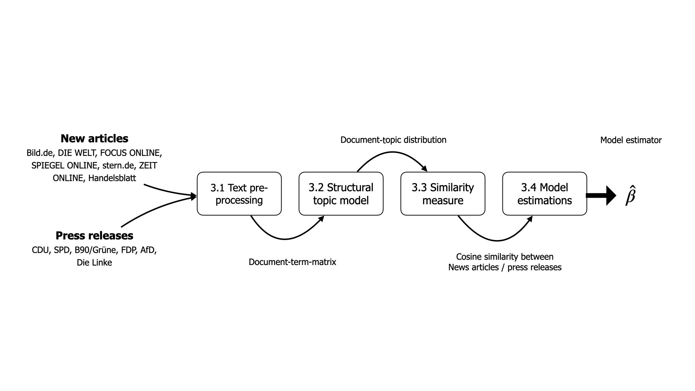
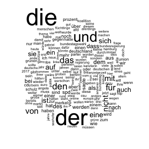
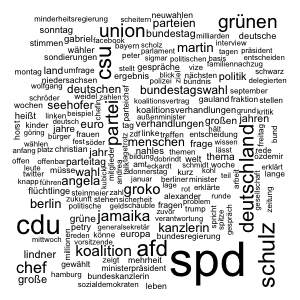

```{r, setup, include=FALSE}
rm(list = ls())
# chunk option defaults
knitr::opts_chunk$set(echo = FALSE, message = FALSE, warning = FALSE, fig.align = 'center')

# packages
library(tidyr)
library(tidytext)
library(dplyr)
library(ggridges)
library(ggplot2)
library(ggrepel)
library(stargazer)
library(kableExtra)
library(ggthemes)
library(readr)
library(stringr)
library(patchwork)
library(stm)
library(magrittr)
library(scales)

# Set globals
election_date <- as.Date('2017-09-24')
max_date <- as.Date('2018-02-13')
parties <- c("AfD","CDU/CSU","FDP","B90/GRÜNE","DIE LINKE","SPD")

load("../output/models/model40_weekly_source.Rda")
model_df <- model_df %>%
  dplyr::mutate(
    doc_index = as.numeric(rownames(.)),
    election_dummy = as.factor(ifelse(date <= election_date, "pre election", "post election")),
    year_week = lubridate::floor_date(date, "1 week")
  )
# functions
source("../docs/func/functions.R")

custom_colors <- c(
  # news articles
  'DIE WELT'='#1b9e77','stern.de'='#d95f02','Handelsblatt'='#7570b3',
  'FOCUS Online'='#a6761d','SPIEGEL ONLINE'='#66a61e','ZEIT ONLINE'='#e6ab02',
  'Bild.de'='#e7298a',
  # parties
  "AfD"="#009ee0","CDU"="#32302e","CDU/CSU"="#32302e","FDP"="#ffed00",
  "B90/GRÜNE"="#46962b","DIE LINKE"="#ec008c","SPD"="#E3000F")

theme_set(theme_bw(base_size=8))
theme_update(axis.text = element_text(size = 8),
             axis.title = element_text(size=8))
```

# I Introduction

In democracies, the media fulfill fundamental functions: They should inform the people, contribute to the formation of opinion through criticism and discussion and thus enable participation. In recent decades, however, concern has grown about the role of the media in politics in general and in election campaigns in particular. They are criticized for influencing election results through their reporting and for helping populist parties in particular to flourish. After the 2017 federal elections in Germany, for example, the media were accused of contributing to the success of the right-wing populist AfD by increasingly including the party's content and using the same language in their articles as the AfD. Representatives of these media houses strongly opposed this accusation. The purpose of this study is to examine whether there is evidence that supports the accusation of biased media reporting, especially during election campaigns. 

For advertising-financed media the battle for the attention of the recipients is at the center of economic decisions. Online media in particular, which offer their content to a large extent free of charge and generate their revenue through advertising space, compete for the scarce resource of attention. Consumers pay a non-monetary price providing their attention, which the media platform bundles and sells on to advertising customers. This business model corresponds to that of a platform market, in which media companies act as platforms that connect the market of advertising with the reader market to exploit the indirect network effects between them [@dewenter_einfuhrung_2014]. A profit-maximizing publisher therefore directs its economic decisions according to what will attract the most attention.

This conclusion, derived from the economic theory of platform markets, corresponds to the notion of media logic, a central concept in the field of media and communication studies [@takens_media_2013]. The debate about media logic is embedded in the broader discussion about the interaction between the press, politics and the public. The underlying thesis is that the content of political news is the product of news values and narrative techniques that media use to attract audiences [@stromback_four_2008]. According to @takens_media_2013, three content attributes highly correspond with news values and influence how journalists interpret political events: 1) personalized content, i.e., the focus on individual politicians; 2) the framing of politics as a contest and 3) negative coverage. Similarly @blassnig_hitting_2019 states that media primarily focus on news factors, i.e. the factors that turn an event into news worth reporting like conflict, drama, negativity, surprise or proximity. Likewise populist messages often co-occur with negative, emotionalized, or dramatized communication style, thus utilizing similar mechanisms as the media logic, respectively the attention economy. In fact, @blassnig_hitting_2019 shows that populist key messages by political and media actors in news articles provoke more reader comments under these articles. Media competing for the attention of readers therefore have an incentive to pick up on the key messages of these parties. These, in turn, benefit from being able to place their agendas in the public debate (@druckman_impact_2005, @eberl_lying_2018). It is assumed, that smaller, non-established parties in particular benefit from placing their topics in the media in order to get them into the voters' heads. Here, the tendency of the reporting is irrelevant but rather the quantity is decisive. 

However, the causal relationship between reporting and voter preferences is not the subject of this study. Rather, it is intended to measure how online news coverage coincides with the messaging of different political parties. Especially during election campaigns political parties want the media agenda to be congruent with their own agenda to define the issue-based criteria on which they will be evaluated by voters [@eberl_one_2017]. Parties instrumentalize their public relations in order to highlight issues that they are perceived to be competent on, that they "own" and that are important to their voters [@kepplinger_einfluss_2004]. This paper therefore analyzes the content of political news in the period before and after the 2017 federal elections in Germany to determine a) the extent to which these news echo topics covered by the parties during the election campaign, b) whether there is a difference between the parties, and c) how and/or if topic similarity changes after the election. 

In order to answer these and other media-related questions in the political context, quantifying the content of media is a prerequisite. One of the key challenges is to determine the features that are used to describe media content - be it audio, video or text content. Studies that rely on quantifying media content for their analyses use, for example, visibility (how often political actors appear in the media 
[@lengauer_candidate_2013]) or tonality (how they are evaluated [@eberl_one_2017]). Other studies examine the topics discussed or the language used in the media, in order to identify whether political actors are able to place their own policy positions in the media. Leading studies from economic literature, for example, examine how often a newspaper quotes the same think tanks (@groseclose_measure_2005, @lott_is_2014) or uses the same language [@gentzkow_media_2004] as members of Congress.
Following this approach, the present paper compares topics discussed in media outlets with topics addressed in the press releases of the parties in the German "Bundestag", to measure the content similarity between online news and parties press releases.^[For the sake of simplicity, both news articles and press releases will be referred to as documents in the following.] To discover the latent topics in the corpus of text data, the structural topic model (STM) developed by @roberts_model_2016 is applied. This probabilistic text model results in a probability distribution for each document across all topics, which is then aggregated to calculate the degree of difference between the news articles of different media providers and the press releases of the parties.

The following Section [II Background information](#ii-background-information) provides background information on the political situation in Germany as well as on the German online news market during the period under consideration. Sections III to V contain the analysis of the text data necessary to answer the research question. The diagram below provides an overview of these steps. Section [III Text data](#iii-text-data) describes the data sources and how text data are processed to be used as input for the structural topic model. Section [IV Estimate topic similarity of documents](#iv-estimate-topic-similarity-of-documents) then explains how the STM uses this input to compute the topic probabilities for the different documents, and how these probabilities are used to compute the similarity between documents. In the final Section [V Regression model](#v-regression-model), the similarity measure is used as a dependent variable in a regression model with different specifications. To provide context, the following section II gives an introduction to the political situation in Germany as well as to the German news market during the study period.


<!-- To Do: Point out distribution to research -->

# II Background information

## The political situation in Germany (June 2017 - March 2018)
The articles analyzed in this paper cover a period from June 1, 2017 to March 1, 2018 and thus cover both the most important election campaign topics for the Bundestag elections on September 24, 2017 and the process of forming a government that lasted until February 2018. After four years in a grand coalition with the Social Democrats (SPD), German Chancellor Angela Merkel, member of the conservative party CDU/CSU (also known as Union), ran for re-election. The SPD nominated Martin Schulz as their candidate.

On the right side of the political spectrum, AfD (alternative for Germany) managed to be elected to the German Bundestag for the first time in 2017. The political debate about the high refugee numbers of the past years brought a political upswing to the AfD, which used the dissatisfaction of parts of the population to raise its own profile. In the course of the reporting on the federal elections, leading party members of the AfD as well as party supporters repeatedly accused the mass media of reporting unilaterally and intentionally presenting the AfD badly.

After the election, the formation of a government was difficult due to the large number of parties elected to the Bundestag and the considerable loss of votes by the major parties CDU/CSU and SPD. Since all parties rejected a coalition with the AfD, numerically only two coalitions with an absolute parliamentary majority were possible: a grand coalition ("GroKo" - from the German word Große Koalition) of CDU/CSU and SPD, and a Jamaica coalition (coalition of CDU/CSU, FDP (economic liberal party) and B90/Die Grünen (Bündnis 90/Die Grünen, green party)). The grand coalition was initially rejected by the SPD. The four-week exploratory talks on the possible formation of a Jamaica coalition officially failed on November 19, 2017 after the FDP announced its withdrawal from the negotiations. FDP party leader Christian Lindner said that there had been no trust between the parties during the negotiations. The main points of contention were climate and refugee policy. CDU and CSU regretted this result, while B90/Die Grünen sharply criticized the liberals’ withdrawal. The then Green leader Cem Özdemir accused the FDP of lacking the will to reach an agreement.

After the failure of the Jamaica coalition talks, a possible re-election or a minority government as alternatives were discussed in the media before the SPD decided to hold coalition talks with the CDU/CSU. This led to great resistance from the party base, which called for a party-internal referendum on a grand coalition. After the party members voted in favor of the grand coalition, a government was formed 171 days after the federal elections.

\autoref{fig:election_polls} shows that support for the two major popular parties has been declining in recent months since August 2017, with the CDU/CSU again showing positive survey results since November 2017.^[For each party the survey results of the seven major institutes are considered. To calculate a smooth line for each party on each day, the moving average within 15 days (7 before the day, 7 after the day, and the day itself) is estimated. The data source is https://www.wahlrecht.de/.] However,the poll results of the SPD have been falling since March 2017. At the same time, the AfD in particular has been recording increasingly positive survey results since June 2017.

```{r election polls, fig.cap= "Election polls during the period under review \\label{fig:election_polls}", out.width="50%", fig.height=4}
load("../data/polldata.Rda")
parties <- c("AfD","CDU/CSU","FDP","B90/GRÜNE","DIE LINKE","SPD")

df.plot <- df.small %>%
  filter(date > as.Date("2017-06-01")) %>%
  filter(date < as.Date("2018-03-01")) %>% 
  mutate(
    party = case_when(
      party == "GRÜNE" ~ "B90/GRÜNE",
      party == "LINKE" ~ "DIE LINKE",
      TRUE ~ party
    )
  )

ggplot(df.plot) +
  geom_point(aes(date, pollvalue,color = party),
             alpha = 0.6, size = 0.4) +
  geom_line(aes(date, ma, color = party), size = 0.8) +
  geom_vline(xintercept = as.Date("2017-09-24"), linetype=2) +
  scale_color_manual(values = custom_colors[parties]) +
  scale_x_date(date_breaks = "1 month", labels = date_format("%m-%Y")) +
  labs(x=NULL,y=NULL,color=NULL) +
  theme(axis.text.x = element_text(angle = 45))
```

## German online news market
The analysis performed in this paper is based on the news articles of the following news websites: Bild.de, DIE WELT, FOCUS ONLINE, Handelsblatt, SPIEGEL ONLINE, stern.de, ZEIT ONLINE. As can be seen from \autoref{fig:news_market}(a), expect for Handelsblatt (position 53), these media outlets are among the top 30 German online news providers in the period under review in terms of visits.^[The term visit is used to describe the call to a website by a visitor. The visit begins as soon as a user generates a page impression (PI) within an offer and each additional PI, which the user generates within the offer, belongs to this visit.] 

The main source of income for these privately managed media houses is digital advertising, even though paid content is playing an increasingly important role. However, according to a survey on digital news by the Reuters Institute [@newman_reuters_2018]  only 8% of respondents pay for online news. The online survey for German data was undertaken between 19th - 22nd January 2018 by the Hans Bredow Institute^[https://www.hans-bredow-institut.de/de/projekte/reuters-institute-digital-news-survey] with a total sample size of 2038 adults (aged 18+) who access news once a month or more. Among other questions, participants were asked which news sources they use to access news online.^[The exact question was: "Which of the following brands have you used to access news online in the last week (via websites, apps, social media, and other forms of Internet access)? Please select all that apply."] The results displayed in \autoref{fig:news_market}(b) indicate that the media used for the analysis play a relevant role in their consumption.

```{r AGOF total visits}
visits <- read_delim("../data/download_201801.csv", ";", escape_double = FALSE, 
                     locale = locale(encoding = "ISO-8859-1"),  trim_ws = TRUE)

media <- c("Bild.de", "SPIEGEL ONLINE", "FOCUS ONLINE", "Handelsblatt.com", "WELT", "ZEIT ONLINE", "stern.de")

visits.df <- visits %>%
  dplyr::transmute(
    medium = Angebote,
    visits = str_replace(`Visits gesamt`, "\\.", ""),
    visits = str_replace(visits, "\\.", ""),
    visits = as.numeric(visits),
    insample = ifelse(medium %in% media, TRUE, FALSE)
  ) %>% 
  dplyr::arrange(desc(visits)) %>% 
  add_rownames(var="medium_range") %>% 
  mutate(medium_order = paste0(medium_range,": ", medium),
         medium_range = as.integer(medium_range))

p1 <-visits.df %>%
  filter(medium_range < 30 | medium %in% media) %>% 
  ggplot(aes(reorder(medium_order, visits), visits/1000000, fill = insample)) +
  geom_col(alpha=0.8, show.legend = F) +
  coord_flip() +
  scale_fill_manual(values = c('#1b9e77','#d95f02')) +
  labs(x = NULL, y= NULL, 
       title = NULL,
       caption = "Data source: AGOF daily digital facts")
```

```{r Reuters - use of a brand to access news online}
reutersDF1 <- readxl::read_excel("../data/reuters_clean.xlsx")
keeps <- c("Bild.de", "Spiegel Online","Welt Online","Focus Online", "Stern.de","ZEIT Online","Handelsblatt online")

reutersDF1.grouped <- reutersDF1 %>%
  gather(key = "orientation", value = "count", -medium) %>%
  group_by(medium) %>%
  summarise(count = sum(count)) %>%
  mutate(insample = ifelse(medium %in% keeps, TRUE, FALSE)) %>% 
  dplyr::arrange(desc(count)) %>% 
  add_rownames(var="medium_range") %>% 
  mutate(medium_order = paste0(medium_range,": ", medium),
         medium_range = as.integer(medium_range))


p2 <- reutersDF1.grouped %>%
  filter(medium_order < 31) %>% 
  ggplot(aes(reorder(medium_order,count),count,
             fill = insample)) +
  geom_col(alpha=0.8, show.legend = F) +
  coord_flip() +
  scale_fill_manual(values = c('#1b9e77','#d95f02')) +
  scale_x_discrete(position = 'top') +
  labs(x = NULL, y = NULL,
       title = NULL, 
       caption = "Source: Hans-Bredow-Institut") 
```

```{r fig.cap="Selected german news brands \\label{fig:news_market}", fig.subcap=c('Total visits in million (Jan 2018)', 'Use of a brand to access news online'), out.width="40%", fig.height=5, fig.ncol=2}
p1
p2
```

# III Text data
I conduct the estimation on a sample of 18,757 online news articles from the seven German news providers described in the previous section ^[Bild.de, DIE WELT, FOCUS ONLINE, SPIEGEL ONLINE, stern.de, ZEIT ONLINE, Handelsblatt] about domestic politics and press releases of the seven parties that have been in the Bundestag since the 2017 federal elections^[CDU, SPD, B90/Grüne, FDP, AfD, Die Linke]. Both news articles and press releases are dated from June 1, 2017 to March 1, 2018.

<!-- News articles -->
News articles scraped from the Webhose.io API.^[For more information see https://docs.webhose.io/reference#about-webhose.] In order to consider only news about national politics, the articles were filtered based on their URL. The press releases were scraped from the public websites of the political parties and parliamentary groups using an automated script.^[The scraping code was written in R and can be made available on request.]

\autoref{fig:news_distr} shows the distribution of the number of articles by date and media outlet. There is a high peak around the federal elections on September, 24th and another one shortly after the failure of the Jamaica coalition talks on November, 19th (indicated by the red dotted lines).^[The peak in July especially for stern.de is due to increased reporting about the G20 summit in Hamburg.] Furthermore, \autoref{fig:news_distr} shows that DIE WELT published the most articles on domestic policy, followed by stern.de, Handelsblatt and FOCUS ONLINE.

```{r Distribution of news articles, fig.height=2, fig.cap="Distribution of news articles \\label{fig:news_distr}", out.width="70%"}
news_df <- model_df %>% filter(type == 'news')

p1 <- news_df %>%
  mutate(date = lubridate::floor_date(date, "1 week")) %>%
  group_by(date, source) %>%
  tally() %>%
  ggplot(aes(date, n, color = source)) +
  geom_line(show.legend = F) +
  labs(title = NULL, x=NULL, y="# of articles") +
  scale_colour_manual(values = custom_colors)+
  theme(legend.title = element_blank())

p2 <- news_df %>%
  group_by(source) %>%
  tally() %>%
  ggplot(aes(n,reorder(source, n), fill = source)) +
  scale_fill_manual(values = custom_colors) +
  geom_col(show.legend = F, alpha=0.8) +
  scale_y_discrete(position = 'right') +
  labs(title = NULL, x=NULL, y=NULL)

p1 + p2 + plot_layout(widths = c(2,1))
```

```{r Distribution of press releases, fig.height=2, out.width="70%", fig.cap="Distribution of press releases \\label{fig:press_distr}"}
press_df <- model_df %>% filter(type == 'press')

p1 <- press_df %>%
  mutate(date = lubridate::floor_date(date, "1 week")) %>%
  group_by(date, source) %>%
  tally() %>%
  ggplot(aes(date, n, color = source)) +
  geom_line(show.legend = F) +
  scale_colour_manual(values =  custom_colors)+
  labs(title = NULL, x=NULL, y="# of press releases") +
  theme(legend.title = element_blank())

p2 <- press_df %>%
  group_by(source) %>%
  tally() %>%
  ggplot(aes(n,reorder(source, n), fill = source)) +
  geom_col(show.legend = F, alpha=0.8) +
  scale_fill_manual(values =  custom_colors) +
  scale_y_discrete(position = 'right') +
  labs(title = NULL, x=NULL, y=NULL)

p1 + p2 + plot_layout(widths = c(2,1))
```

```{r table text length}
model_df %>%
  group_by(source, type) %>% 
  summarize(
    n = n(),
    mean = round(mean(text_length),2),
    sd = round(sd(text_length),2),
    median = median(text_length),
    min = min(text_length),
    max = max(text_length)
  ) %>% arrange(type) %>% select(-type) %>% 
  kbl(format = 'latex', 
      caption = "Summary statistics of word counts \\label{tab:textlength}",
      booktabs = T) %>% 
  kable_styling(latex_options = c("striped","HOLD_position"), 
                font_size = 7,
                full_width = F) %>% 
    pack_rows("News articles", 1, 7) %>% 
    pack_rows("Press releases", 8, 13)
```

<!-- text length -->
\autoref{tab:textlength} illustrates that on average, news articles have a higher word count than the parties' press releases.^[News articles with less than 120 words were filtered out in advance, as these were mostly reader comments. Similarly press releases with less than 100 words were filtered out.] While for news articles the average is between 394 (FOCUS Online) and 590 (Handelsblatt), with press releases the range is between 162 (FDP) and 275 (CDU). The article with the most words (14.507) was published by DIE WELT - the longest press release has 1.048 words and was published by DIE LINKE.

## Text pre-processing

To use text as data for statistical analysis, different pre-processing steps have to be conducted. In fact, in order to use text as data and reduce the dimensionality to avoid unnecessary computational complexity and overfitting, pre-processing the text is a central task in text mining (@gentzkow_text_2017, @bholat_text_2015). Intuitively the term frequency (tf) of a word is a measure of how important that word may be for the understanding of the text. To visualize these terms, word clouds are a commonly used technique in text mining as they translate the tf into the size of the term in the cloud. As can be seen in \autoref{fig:wordcloud1}, problems arise with words that are highly frequent. For example "die", or "der" (eng. "the"), "und" (eng.  "and"), and "ist" (eng. "is") are extremely common but unrelated to the quantity of interest. These terms, often called stop words [@gentzkow_text_2017], are important to the grammatical structure of a text, but typically don't add any additional meaning and can therefore be neglected. 

```{r eval=FALSE, include=FALSE}
png('../figs/wordcloud.png', width = 300, height = 300)
wordcloud::wordcloud(model_df$title_text, max.words = 200)
dev.off()

png('../figs/wordcloud_bild.png', width = 300, height = 300)
temp_df <- model_df %>% filter(source=="Bild.de")
wordcloud::wordcloud(temp_df$text_cleaned, max.words = 200)
dev.off()
 
png('../figs/wordcloud_afd.png', width = 300, height = 300,)
temp_df <- model_df %>% filter(source=="AfD")
wordcloud::wordcloud(temp_df$text_cleaned, max.words = 200)
dev.off()
```

```{r wordcloud pre-processing, fig.height=2, out.width="40%", fig.cap="Wordcloud before pre-processing \\label{fig:wordcloud1}"}

```

To remove distorting words, the predefined stop word list from the Snowball project^[http://snowball.tartarus.org/algorithms/german/stop.txt] is used together with a customized, domain-specific list of stop-words. Additionally punctuation characters (e.g. ., ,, !, ?, etc.) and all numbers are removed from the data. A next step to reduce the dimensionality of text data is to apply an adequate stemming technique. Stemming is a process by which different morphological variants of a word are traced back to their common root. For example, "voting" and "vote" would be treated as two instances of the same token after the stemming process. There are many different techniques for the stemming process. I apply the widely used Porter-Stemmer algorithm, which is based on a set of shortening rules that are applied to a word until it has a minimum number of syllables.^[https://tartarus.org/martin/PorterStemmer/] 

As an example, the following word clouds represent the most frequent words of the pre-processed articles for Bild.de (\autoref{fig:wordclouds2}(a)) and press releases of AfD (\autoref{fig:wordclouds2}(b)). It becomes evident that these are texts discussing domestic policy issues. The SPD in particular seems to be highly frequent for Bild.de.

```{r wordclouds2, fig.align="center", fig.cap="Wordcloud after pre-processing \\label{fig:wordclouds2}", fig.height=3, fig.ncol=2, fig.subcap=c('Bild', 'AfD'), message=FALSE, warning=FALSE, out.width="40%"}

knitr::include_graphics("../figs/wordcloud_afd.png")
```

<!--- Document-term-matrix -->
The next step is to divide the entire data set into individual documents and to represent these documents as a finite list of unique terms. In this setting, each news article and each press release represents a document $d$, whereby each of these documents can be assigned to a news website or a party. The sum of all documents forms what is called the corpus. For each document $d \in \lbrace 1,...,D \rbrace$ the number of occurrences of term $v$ in document $d$ is computed, in order to obtain the count $x_{d,v}$, where each unique term in the corpus is indexed by some $v \in \lbrace 1,...,V \rbrace$ and where $V$ is the number of unique terms. The $D$ x $V$ matrix $\boldsymbol{X}$ of all such counts is called the document-term matrix. Each row in this matrix represents a document, where each entry in this row counts the occurrences of a unique term in that document. \autoref{table:dtm} provides a sample output of the document-term matrix used in this paper, where each document is represented by a unique id (the row name in the example below). This representation is often referred to as the bag of words model [@gentzkow_text_2017], since the order in which words are used within a document is disregarded. 

```{r Document term matrix, results='asis'}
dtm <- as.data.frame(as.matrix(news_df_sparse))
dtm[sample(nrow(dtm),10), sample(ncol(dtm),7)] %>% 
  kbl(format = 'latex', 
      caption = "Document-term matrix - sample values \\label{table:dtm}",
      booktabs = T) %>% 
  kable_styling(latex_options = c("striped","HOLD_position"), 
                font_size = 7,
                full_width = F)
```

# IV Estimate topic similarity of documents

## A structural topic model to identify the latent topics

To discover the latent topics in the corpus of press releases and news articles, a structural topic modeling (STM) developed by [@roberts_model_2016] is applied. In general, topic models formalize the idea that documents are formed by hidden variables (topics) that generate correlations among observed terms. They belong to the group of unsupervised generative models, meaning that the true attributes (topics) cannot be observed. The STM is an extension of the standard topic modelling technique, labeled as latent Dirichlet allocation (LDA), which refers to the Bayesian model in @blei_latent_2003 that treats each word in a topic and each topic in a document as generated from a Dirichlet-distributed prior.^[See also @griffiths_probabilistic_2002, @griffiths_finding_2004 and @hofmann_probabilistic_1999]. 

The underlying idea for these models suggests that each individual topic $k$ potentially contains all of the unique terms within the vocabulary $V$ with different probability. Therefore, each topic $k$ can be represented as a probability vector $\phi_k$ over all unique terms $V$. Simultaneously, each individual document $d$ in the corpus can be represented as a probability distribution $\theta_d$ over the $K$ topics. 

The STM is an extension of the LDA process since it allows covariates of interest (such as the publication date of a document or it's author) to be included in the prior distributions for both topic proportions ($\theta$) and topic-word distributions ($\phi$). This way, STM offers a method of 'structuring' the prior distributions in the topic model, including additional information in the statistical inference procedure, while LDA assumes that $\theta ~ \text{Dirichlet}(\alpha)$ and $\phi ~ \text{Dirichlet}(\beta)$, where $\alpha$ and $\beta$ are fitted with the model. 

In order to include the covariates in the statistical inference procedure, two design matrices of covariates ($X$ and $Z$) are specified, where each row defines a vector of covariates for a specific document. In $X$, the covariates for topic prevalence are given, so that the probability of a topic for each document varies according to $X$, rather than resulting from a single common prior. The same applies to $Z$, in which the covariates for the word distribution within a topic are specified. The underlying data generating process to generate each individual word $w_{d,n}$ in a document $d$ for the $n^{th}$ word-position can be described as follows:

- for each document $i$, draw its distribution of topics $\theta_d$ depending on the metadata included in the model defined in $X$; 
- for each topic $k$, draw its distribution of words $\phi_k$ depending on the metadata included in the model defined in $Z$;
- for each word $n$, draw its topic $z_n$ based on $\theta_i$;
- for each word word $n$, draw the term distribution for the selected topic $\phi_{z_{d,n}}$.

<!-- model specification -->
One crucial assumption to be made for topic models like LDA or STM is the number of topics ($K$) that occur over the entire corpus. There is not a "right" answer to the number of topics that are appropriate for a given corpus [@grimmer_text_2013]. @roberts_stm:_2016 proposes to measure topic quality through a combination of semantic coherence and exclusivity of words to topics. Semantic coherence is a criterion developed by @mimno_optimizing_2011 and is closely related to pointwise mutual information [@newman_automatic_2010]: it is maximized when the most probable words in a given topic frequently co-occur together.

Using the function $searchK$ from the $stm$ package several automated tests are performed to help choose the number of topics including the average exclusivity and semantic coherence as well as the held out likelihood [@wallach_rethinking_2009] and the residuals [@taddy_estimation_2012]. This process revealed that a model with 40 topics best reflects the structure in the corpus. Furthermore, I use the author and bi-week dummies of a document as topical prevalence variables. In other words, I assume that the probability of a topic to be included in a news article or a press release depends on the author of that document and when it was published. I argue that these variables are best suited to capture temporal and publisher level variation in the documents.

```{r STM specification, eval=FALSE, include=FALSE}
stmModel$settings$call
```

In general inference of mixed-membership models, such as the one applied in this paper, has been a thread of research in applied statistics [@blei_latent_2003, @erosheva_mixed-membership_2004, @braun_variational_2010]. Topic models are usually imprecise as the function to be optimized has multiple modes, such that the model results can be sensitive to the starting values (e.g. the number of topics and the covariates influencing the prior distributions). Since an ex ante valuation of a model is hardly possible, I compute a variety of different models and compare their posterior probability. This enables me to check how results vary for different model specifications [@roberts_navigating_2016]. I then cross-checked some subset of assigned topic distributions to evaluate whether the estimates align with the concept of interest [@gentzkow_text_2017]. 

## Results of the STM
```{r Prepare dataframes}
td_beta <- tidy(stmModel)
td_gamma <- tidy(stmModel, matrix = "gamma",
                 document_names = rownames(model_df))

top_terms <- td_beta %>%
  arrange(beta) %>%
  group_by(topic) %>%
  top_n(7, beta) %>%
  arrange(-beta) %>%
  select(topic, term) %>%
  summarise(terms = list(term)) %>%
  mutate(terms = purrr::map(terms, paste, collapse = ", ")) %>% 
  unnest()

gamma_terms <- td_gamma %>%
  group_by(topic) %>%
  summarise(gamma = mean(gamma)) %>%
  arrange(desc(gamma)) %>%
  left_join(top_terms, by = "topic") %>%
  mutate(topic_str = paste0("Topic ", topic),
         topic_str = reorder(topic_str, gamma),
         topic_label = paste0(topic_str,": ", terms))

theta <- as.data.frame(stmModel$theta) %>% 
  mutate(doc_index = as.numeric(rownames(.))) %>%
  # convert to long format
  gather(topic, theta, -doc_index) %>%
  mutate(topic = as.numeric(gsub("V","",topic))) %>%
  left_join(., gamma_terms, by="topic") %>%
  left_join(., model_df %>% 
              select(date,type,source,doc_index,title, election_dummy, year_week), 
            by="doc_index") %>% 
  select(doc_index, topic, theta, topic_label, date, type, 
         source, title, election_dummy, year_week)
```

As mentioned in the previous section, the generative process of the STM results in a topic distribution $\theta_d$ for each document $d$ over all topics $k$ and a word distribution $\phi_k$ for each topic over all terms in the vocabulary. The most probable words of each topic may help to understand what each topic is about.^[\autoref{table:top_terms} gives an overview of the most probable terms for each topic.] However, since those most probable words are not necessarily the most exclusive words and they only represent a small fraction of the probability distribution, interpretation should be done very cautiously.

For our analysis, we use the topic distribution of each document to estimate the similarity of documents. \autoref{fig:sample_docs12} illustrates such a topic distribution of two newspaper articles. The red numbers display the topic probability (for probabilities $>= 0.02$). News article 1^[Bundeswehr scandal: ex-commander attacks Von Der Leyen] shows a clear distribution towards topic 36, for which terms like Bundeswehr, Soldaten (soldiers), Nato, Verteidigungsministerin (defense minister) are among the most probable words. News article 2^[Bundestag elections: 42 parties want to be elected to parliament.] does not show such a clear tendency towards a single topic. Topic 40, 18 and 5 are within a comparable range. However, for all three topics similar terms are among the top terms.

Similarly as for the news articles, \autoref{fig:sample_docs34} illustrates the topic distribution for two press releases randomly chosen from the corpus. For press release 1^[Lars Herrmann: The danger for Germany and its Basic Law is also coming from the left] topic 24 is the most probable topic which contains terms about the G20 Summit, during which left-wing radicals caused considerable riots. Topic distribution of press article 2^[Trump chooses the path to isolation] shows peaks for topic 6 and 35. Top terms of topic 6 contain the words trump, us, usa, deutschland (Germany) and präsident (president). Similarly topic 35 seems to deal with German foreign policy, since top terms include words like eu, deutschland (Germany), europa and bundesregierung (Federal Government).

```{r News articles sample documents, fig.cap="Topic probability of sample news articles \\label{fig:sample_docs12}", fig.height=3, out.width="80%"}
# Bundeswehr / v.d.Leyen
sample1 <- 6397
p1 <- plot_topic_distr_document(sample1)

# Wahlen (ZEIT ONLINE)
sample2 <- 5833
p2 <- plot_topic_distr_document(sample2)

p1 / p2
```

```{r Press releases sample documents, fig.cap="Topic probability of sample press releases \\label{fig:sample_docs34}", fig.height=3, out.width="80%"}
# Linke Gefahr (AfD)
sample3 <- 17511
p1 <- plot_topic_distr_document(sample3)

# Trump (B90/Gruene)
sample4 <- 17600
p2 <- plot_topic_distr_document(sample4)

p1 / p2
```

Since the source and publication date is known for each document, the probability of certain topics can be analysed, aggregated by this metadata. The left chart of \autoref{fig:sample_topics_afd} is showing the 15 topics with the highest probability for press releases published by the AfD. The right side of the figure is aggregating the probability by source and time (in weeks) for two sample topics, displaying how they change over time in the AfD press releases compared to two sample news papers. It becomes clear that topic 9^[translation: afd, party, saxony, gauland, parties, pazderski, höcke] is systematically more likely in the AfD's press releases compared to the two newspapers. There is a noticeable increase in probability during the election campaign period and ends in a peak on election day itself. For Handelsblatt and Bild.de, too, a slight increase around election day is discernible and the probability of this topic shows some peaks for Bild.de both before and after the election. 
The top words of Theme 38^[translation: refugees, germany, people, number, refugees, family reunion, year] suggest that it addresses refugees - a topic the AfD has a very clear position on. The probability of this topic increases in the AfD's press releases until about a month before the election and then levels off somewhat. A similar trend can be seen for the news articles from Bild.de. The curve from Handelsblatt is rather flat and shows no apparent difference between before and after the election. 

```{r Top AfD topics, fig.cap="Comparison of topic probability - sample topics AfD \\label{fig:sample_topics_afd}", fig.height=3, out.width="100%"}
p1 <- theta %>%
  filter(source == 'AfD') %>% 
  filter(date <= max_date) %>% 
  group_by(topic, source) %>% 
  summarise(theta_mean = mean(theta, na.rm = T)) %>% 
  ungroup() %>% 
  top_n(n = 10, wt = theta_mean) %>% 
  ggplot(aes(reorder(topic, theta_mean), theta_mean, fill = source))+
  geom_col(show.legend = F, fill='#009ee0', aplha = 0.7) +
  coord_flip() +
  labs(x = NULL, y = 'Topic proportion', 
       title = NULL,
       subtitle = 'Top 15 topics with highest probability') +
  theme(axis.text = element_text(size = 5),
        axis.title = element_text(size= 5),
        plot.subtitle = element_text(size=6))

source_filter <- c('AfD', 'Bild.de', 'Handelsblatt')

p2 <- plot_topic_distr_time(9, source_filter) + theme(legend.position = 'none')
p3 <- plot_topic_distr_time(38, source_filter) + labs(title = NULL)

p1 + (p2 / p3) + plot_layout(widths = c(1,2))
```

\autoref{fig:sample_topics_fdp} is doing a similar analysis for the aggregated topic distribution in press releases of the FDP. The chart on the left illustrates that, as in the case of the AfD, the topic 35 has the highest probability in the press releases of the FDP. Unlike in the case of the AfD, however, this is followed by topics that have clearer temporal peaks, as shown on the right using two example topics. Topic 10^[translation: diesel, enterprises, germany, cars, german, industry, driving bans] has a clear peak for both the newspapers and the FDP press releases around august 2017. At that time, there was a debate about whether and where driving bans for diesel cars would be introduced. After the states of Baden-Württemberg and North Rhine-Westphalia initially filed a lawsuit against this, the court proceedings that would decide whether driving bans are permissible began in mid-February 2018. The temporal curve of the FDP shows a further increase in topic probability at this time, which can also be detected at Handelsblatt. At Bild.de, however, the topic is apparently only taken up once briefly in August 2017, as only a very low topic probability can be seen thereafter.
The peak of the probability of topic 39^[translation: fdp, grünen, jamaika, cdu, union, grüne, cdu] in all three sources right after the election is reflecting the exploratory talks on the possible formation of a Jamaica coalition, which officially failed on November 19, 2017 after the FDP announced its withdrawal from the negotiations.

```{r Top FDP topics, fig.cap="Comparison of topic probability - sample topics FDP \\label{fig:sample_topics_fdp}", fig.height=3, out.width="100%"}
p1 <- theta %>% 
  filter(date <= max_date) %>% 
  filter(source == 'FDP') %>% 
  group_by(topic, source) %>% 
  summarise(theta_mean = mean(theta, na.rm = T)) %>% 
  ungroup() %>% 
  top_n(n = 10, wt = theta_mean) %>% 
  ggplot(aes(reorder(topic, theta_mean), theta_mean, fill = source))+
  geom_col(show.legend = F, fill="#ffed00", alpha = 0.9) +
  coord_flip() +
  labs(x = NULL, y = 'Topic proportion', 
       title = NULL,
       subtitle = 'Top 15 topics with highest probability') +
  theme(axis.text = element_text(size = 5),
        axis.title = element_text(size= 5),
        plot.subtitle = element_text(size=6))

source_filter <- c('FDP', 'Bild.de', 'Handelsblatt')
p2 <- plot_topic_distr_time(10, source_filter) + theme(legend.position = 'none')
p3 <- plot_topic_distr_time(39, source_filter) + labs(title = NULL)

p1 + (p2 / p3) + plot_layout(widths = c(1,2))
```

## Cosine similarity 

```{r Create matrix of topic distribution }
td_gamma <- tidy(stmModel,
  matrix = "gamma",
  document_names = rownames(news_df_sparse)
) %>%
  mutate(doc_index = as.integer(document)) %>%
  select(-document)

# convert to "wide" data frame
td_gamma_wide <- td_gamma %>%
  spread(doc_index, gamma) # one row per topic, one column per document

# convert to matrix
gamma <- as.matrix(td_gamma_wide[, -1])
```

Next, the cosine similarity measure is used in order to compare the retrieved topic distribution of documents. Cosine similarity is a measure for the distance between two vectors and is defined between zero and one; values towards 1 indicate similarity. As topic proportions per document are vectors of the same length, the cosine similarity allows a comparison of the topic distribution between two documents.^[For applications of cosine similarity to compare of topic model outcomes see e.g. @rehs_structural_2020 and @ramage_characterizing_2010]

$$
\text{CS} = \text{cos}(\theta)=\frac{a*b}{||a|| ||b||}
$$

For example, \autoref{table:cosine_sim_sample_doc}^[Translations: 1) Asylum figures 2017 - black-red (synonym for GroKo) introduces upper limit through the back door (DIE LINKE) 2) Jörg Meuthen: Not a new GroKo, but LoKo - Loser Coalition (AfD) 3) Pension plans of Union and SPD worse than expected (FDP) 4) Union and SPD stabilize the extreme social injustice in this country (DIE LINKE) 5) Jürgen Pohl: Union and SPD agree on policy at the expense of pensioners and East Germans (AfD)] displays the most similar documents of the document with the title *Parteitag, Koalitions-Krimi, Ur-Wahl - Woran kann die GroKo jetzt noch scheitern? (Bild.de)*.^[Translation: Party conference, coalition thriller, primal election - what can fail the GroKo now? (Bild.de)]

```{r Documents with highest similarity, results='asis'}
sample_doc <- 453

calc_cos_sim(sample_doc) %>%
  mutate(doc_index = doc_code2) %>%
  left_join(.,
    model_df %>%
      select(title, source, doc_index, type),
    by = "doc_index"
  ) %>%
  filter(type == "press") %>%
  arrange(desc(cos_sim)) %>%
  top_n(5, cos_sim) %>% 
  select(title, source, cos_sim) %>% 
  mutate(cos_sim = round(cos_sim,3)) %>% 
  kbl(format = 'latex', 
      caption = "Most similar documents \\label{table:cosine_sim_sample_doc}",
      booktabs = T) %>% 
  kable_styling(latex_options = c("striped","HOLD_position"), 
                font_size = 7,
                full_width = F)
```

In the next step, for each news paper, the cosine similarity between all topic-document distribution pairs between the news papers articles and the press releases is calculated if that press releases was published within 7 days before the publication date of the news article. This means the topic distribution of news article 1 is compared to press release 1, 2, 3 and so on as long as the press release was published within 7 days before the news article. \autoref{table:dataset_structure1} illustrates a sample subset of the data for DIE WELT.

```{r Prepare sample dataframe, include=FALSE}
target_source <- "DIE WELT"
load(paste0("../output/cosine_dist_", target_source, ".Rda"))
cosine_distances_df <- df_prep_ols(welt)

temp_df <- welt %>%
  left_join(., model_df %>%
              transmute(
                  title1 = title,
                  doc_code1 = doc_index,
                  source1 = source, type1 = type,
                  date1 = date
                ),
              by = "doc_code1"
    ) %>%
  left_join(., model_df %>%
              transmute(
                title2 = title,
                doc_code2 = doc_index,
                source2 = source, type2 = type,
                date2 = date
                ),
            by = "doc_code2"
            ) %>%
  filter(type2 == 'press') %>% 
  mutate(cos_sim = round(cos_sim, 2),
         title1 = str_trunc(title1, 20, "right"),
         title2 = str_trunc(title2, 20, "right"),
         date2 = as.character(date2),
         date1 = as.character(date1),
         cosine_sim = round(cos_sim,3)
         )
```

```{r Dataset structure 1, results='asis'}
temp_df %>% 
  sample_n(5) %>%
  select(title1, title2, cosine_sim, source1, source2, date1, date2) %>%
  kbl(format = 'latex', 
      caption = "Dataset structure step 1 - DIE WELT \\label{table:dataset_structure1}",
      booktabs = T) %>% 
  kable_styling(latex_options = c("striped","HOLD_position"), 
                font_size = 7,
                full_width = F)
```

Next, the mean cosine similarity for each news article publication date (date1) and party (source2) is estimated to obtain the final data frame (see \autoref{table:dataset_structure_final}).

```{r Dataset structure final, results='asis'}
temp_df %>%
  group_by(date1, source1, source2) %>% 
  summarise(cos_sim = round(mean(cos_sim, na.rm = T),2)) %>% 
  ungroup() %>% 
  sample_n(5) %>%
  kbl(format = 'latex', 
      caption = "Final dataset structure - DIE WELT \\label{table:dataset_structure_final}",
      booktabs = T) %>% 
  kable_styling(latex_options = c("striped","HOLD_position"), 
                font_size = 7,
                full_width = F)
```

# V Regression model

```{r Plot data & estimate models}
target_source <- "DIE WELT"
load(paste0("../output/cosine_dist_", target_source, ".Rda"))
cosine_distances_df <- df_prep_ols(welt)
welt_p <- plot_cosine_sim_ols(cosine_distances_df, target_source) # plot data
welt_p1 <- plot_cosine_sim_rd(cosine_distances_df, target_source) # plot data rd
welt_model <- calc_ols_dummy(cosine_distances_df) # estimate OLS
welt_model1 <- calc_rd(cosine_distances_df) # estimate rd I
welt_model2 <- calc_rd_dummy_interaction(cosine_distances_df) # estimate rd II

target_source <- "stern.de"
load(paste0("../output/cosine_dist_", target_source, ".Rda"))
cosine_distances_df <- df_prep_ols(stern)
stern_p <- plot_cosine_sim_ols(cosine_distances_df, target_source) # plot data
stern_p1 <- plot_cosine_sim_rd(cosine_distances_df, target_source) # plot data rd
stern_model <- calc_ols_dummy(cosine_distances_df) # estimate OLS
stern_model1 <- calc_rd(cosine_distances_df) # estimate rd I
stern_model2 <- calc_rd_dummy_interaction(cosine_distances_df) # estimate rd II

target_source <- "ZEIT ONLINE"
load(paste0("../output/cosine_dist_", target_source, ".Rda"))
cosine_distances_df <- df_prep_ols(zeit)
zeit_p <- plot_cosine_sim_ols(cosine_distances_df, target_source) # plot data
zeit_p1 <- plot_cosine_sim_rd(cosine_distances_df, target_source) # plot data rd
zeit_model <- calc_ols_dummy(cosine_distances_df) # estimate OLS
zeit_model1 <- calc_rd(cosine_distances_df) # estimate rd I
zeit_model2 <- calc_rd_dummy_interaction(cosine_distances_df) # estimate rd II

target_source <- "Handelsblatt"
load(paste0("../output/cosine_dist_", target_source, ".Rda"))
cosine_distances_df <- df_prep_ols(handelsblatt)
handelsblatt_p <- plot_cosine_sim_ols(cosine_distances_df, target_source) # plot data
handelsblatt_p1 <- plot_cosine_sim_rd(cosine_distances_df, target_source) # plot data rd
handelsblatt_model <- calc_ols_dummy(cosine_distances_df)
handelsblatt_model1 <- calc_rd(cosine_distances_df) # estimate rd I
handelsblatt_model2 <- calc_rd_dummy_interaction(cosine_distances_df) # estimate rd II

target_source <- "FOCUS Online"
load(paste0("../output/cosine_dist_", target_source, ".Rda"))
cosine_distances_df <- df_prep_ols(focus)
focus_p <- plot_cosine_sim_ols(cosine_distances_df, target_source) # plot data
focus_p1 <- plot_cosine_sim_rd(cosine_distances_df, target_source) # plot data rd
focus_model <- calc_ols_dummy(cosine_distances_df)
focus_model1 <- calc_rd(cosine_distances_df) # estimate rd I
focus_model2 <- calc_rd_dummy_interaction(cosine_distances_df) # estimate rd II

target_source <- "Bild.de"
load(paste0("../output/cosine_dist_", target_source, ".Rda"))
cosine_distances_df <- df_prep_ols(bild)
bild_p <- plot_cosine_sim_ols(cosine_distances_df, target_source) # plot data
bild_p1 <- plot_cosine_sim_rd(cosine_distances_df, target_source) # plot data rd
bild_model <- calc_ols_dummy(cosine_distances_df)
bild_model1 <- calc_rd(cosine_distances_df) # estimate rd I
bild_model2 <- calc_rd_dummy_interaction(cosine_distances_df) # estimate rd II

target_source <- "SPIEGEL ONLINE"
load(paste0("../output/cosine_dist_", target_source, ".Rda"))
cosine_distances_df <- df_prep_ols(spiegel)
spiegel_p <- plot_cosine_sim_ols(cosine_distances_df, target_source)
spiegel_p1 <- plot_cosine_sim_rd(cosine_distances_df, target_source)
spiegel_model <- calc_ols_dummy(cosine_distances_df)
spiegel_model1 <- calc_rd(cosine_distances_df) # estimate rd I
spiegel_model2 <- calc_rd_dummy_interaction(cosine_distances_df) # estimate rd II
```

Finally, cosine similarity can be used as independent variable in different model specifications to answer the research questions of this paper: (a) whether the issues addressed by the parties during the campaign are echoed in online news, (b) whether there is a difference with respect to parties, and (c) how and/or whether issue similarity changes after the election. In [OLS dummy regression](#ols-dummy-regression) a OLS model with party dummies is computed for the pre-election period to examine the extent to which the news outlets pick up on the parties' issues during election campaigns. Next, we estimate a regression discontinuity specification to test whether Election Day had an effect on overall topic similarity ([Regression discontinuity model
](#regression-discontinuity-model)).

## OLS dummy regression

To measure whether there is a significant difference in the topic similarity for each party for a news publisher, a simple OLS regression is estimated, where the similarity score ($\ln(\text{CS}_{t})$) on day $t$ between the news articles of that news publisher and the press releases of a political party $k$ is the dependent variable and the political party dummies are the independent variables.

$$
\ln(\text{CS}_{t})=\beta_0+\beta_nD_{t,k-1}+\epsilon_t\text{,}
$$ 

with $t$ = date^[date1 in \autoref{table:dataset_structure_final}], $k$ = political party^[source2 in \autoref{table:dataset_structure_final}]

### OLS dummy results

The columns in \autoref{table:results_ols} report the results for each new publisher.^[All regression output tables are created using @hlavac_stargazer_2018] Since the dependent variable is log transformed, the the % impact of $D$ on $Y$ can be estimated as $exp(\hat\beta)-1$. E.g. since the transformed coefficient for $D_{B90/GRÜNE}$ in the first column - representing the model for DIE WELT - is $-0.279$, a switch from from 0 to 1 can be interpreted as a $36.4\%$ decrease of topic similarity for B90/GRÜNE compared to AfD (the base dummy group), holding everything else equal. In other words: Compared to AfD, the similarity of topics of DIE WELT and B90/GRÜNE is $36.4\%$ lower. \autoref{fig:coeff_ols_dummy} plots the transformed coefficients for all news paper / party pairs (insignificant coefficients are shown with a low opacity). In general, for all newspapers - except for Handelsblatt - the topic similarity is significantly less between the news articles of that newspaper and press releases of political parties when compared to press releases of the AfD. The biggest difference for all parties exists for Bild.de followed by FOCUS ONLINE and DIE WELT. In the case of Handelsblatt no significant difference can be found for CDU/CSU, B90/GRÜNE and SPD (compared to AfD). However, the positive coefficients of DIE LINKE indicate that the topics discussed in press releases of that party and the articles of Handelsblatt are significantly similar when compared to the press releases of the AfD.

```{r Extract coefficient}
news_names = c('DIE WELT','stern.de','Handelsblatt','FOCUS Online','SPIEGEL ONLINE','ZEIT ONLINE','Bild.de')
news_models = list(welt_model,stern_model,handelsblatt_model,focus_model,spiegel_model,zeit_model,bild_model)

for (i in 1:length(news_names)) {
  model <- news_models[[i]]
  
  temp_df <- as_tibble(
    cbind(
      news= news_names[i],
      covariate = names(model$coefficients),
      coeff = summary(model)$coefficients[,1],
      p_val = round(summary(model)$coefficients[,4], 3)
      )) %>% 
    mutate(
      coeff = as.numeric(coeff),
      coeff_transf = round(transform_coeff_ols(coeff),3) * 100
      ) %>%
    filter(covariate != "(Intercept)")
  
  if (i == 1) {
    plot_df <- temp_df
  } else {
    plot_df <- rbind(plot_df, temp_df)
  }
}

plot_df %<>% 
  mutate(covariate = str_remove(covariate, "source2"),
         significant = ifelse(p_val < 0.1, 1, 0)
         )
```

```{r Plot coefficients - simple dummy, fig.cap="Coefficients of OLS dummy regression \\label{fig:coeff_ols_dummy}", fig.height=3, out.width="100%"}
parties <- c("CDU","FDP","B90/GRÜNE","DIE LINKE","SPD")

plot_df %>% 
  ggplot(aes(x=covariate, y=coeff_transf, color = covariate, alpha=significant)) +
  geom_point() +
  geom_label_repel(aes(label= ifelse(significant==1,
                                     paste0(as.character(coeff_transf),'%'),'')),
                   box.padding   = 0.35, 
                  point.padding = 0.5,
                  segment.color = 'grey50',
                   show.legend = FALSE, size = 1.5) +
  geom_segment( aes(x=covariate, xend=covariate, y=0, yend=coeff_transf)) +
  scale_color_manual(values = custom_colors[parties]) +
  geom_hline(yintercept = 0, color = custom_colors["AfD"]) +
  facet_wrap(~news, nrow = 1) +
  labs(y=expression('% change*'), x = NULL,
       caption = expression(paste('*% change=(exp(',beta,')-1)*100'))) +
  theme(
      strip.background = element_blank(),
      panel.grid.major.x = element_blank(),
      axis.ticks.x = element_blank(),
      axis.text.x = element_blank(),
      legend.title = element_blank(),
      legend.position = "bottom") +
  scale_alpha(guide = 'none')
```

```{r Model results OLS dummy 1, results='asis' }
table <- capture.output({
  stargazer::stargazer(welt_model, stern_model, zeit_model, handelsblatt_model, 
                     focus_model, bild_model, spiegel_model,
                     column.labels = c("DIE WELT", "stern.de", "ZEIT ONLINE", 
                                       "Handelsblatt", "FOCUS Online", "Bild.de", 
                                       "SPIEGEL ONLINE"),
                     dep.var.labels = paste0("Cosine similarity of topic distribution"), 
                     header = FALSE, digits = 3, 
                     type = "latex",
                     label = "table:results_ols",
                     title = "Results from the OLS dummy regression")
})

table <- remove_text(table)
table <- gsub("\\begin{tabular}","\\resizebox{0.99\\textwidth}{!}{\\begin{tabular}", table,fixed=T)
table <- gsub("\\end{tabular}","\\end{tabular}}", table,fixed=T)
cat(table)
```

## Regression discontinuity model

We assume that news publisher report differently during election campaigns and that the election day introduces a change in the reporting. The underlying dynamic of this assumption coincides with the basic idea of regression discontinuity design (RDD). Therefore, a RDD is applied to identify the short-term effect of the election on the topic similarity between news paper articles and press releases.
The RDD was designed by @thistlethwaite_regression-discontinuity_1960 and formalized by @hahn_identification_2001 to measure the effect of a treatment in a nonexperimental setting, where the treatment defined as discontinuous function of a continuous, observed variable (the 'running' or 'forcing' variable). Like @thistlethwaite_regression-discontinuity_1960, who estimated the effect of receiving the National Merit Scholarship on future academic outcomes, early studies that rely on RD designs estimate the effects of certain thresholds of a running variable on educational outcomes (i.e. financial aid (@van_der_klaauw_estimating_2002) or class size (@angrist_using_1999)). Following these early studies in the area of education, the RDD has received attention in a wider range of the economic literature, including labor economics, political economy, health economics, and environmental economics. Compared to alternative quasi-experimental estimators like difference-in-difference and matching techniques, RDD is considered as the estimator with the greatest internal validity (@lee_regression_2010). 

<!-- RDiT -->
While RDD was originally applied in cross-sectional studies, an increasing number of studies, especially in the field of environmental and energy economics, has adapted the framework to time series applications.^[See @hausman_regression_2018 for examples of this regression discontinuity in time (RDiT).] In these studies, time is the running variable and treatment begins at a particular threshold in time. An important conceptual difference between regression discontinuity (RD) and regression discontinuity in time (RDiT) exists in the possible interpretation. The fact that in RDiT the running variable of time is not random, eliminates the interpretation of local randomization in which it is assumed that treatment status within a small neighborhood around the threshold can essentially be compared to a roll of the dice. As noted by @jacob_practical_2012, although some researchers have focused on this interpretation of local randomization (@lee_regression_2010), others have instead emphasized that RD is characterized by discontinuity at a threshold (@hahn_identification_2001). Thus, to the extent that the RD framework is simply another quasi-experimental framework (one that uses discontinuity), RDiT is conceptually similar to RD.

In this paper date is the running variable, the election day is the treatment and news publishers are the units that receive the treatment. Since the running variable (date) completely determines the treatment (election day), a sharp regression design is used, such that the probability that a news publisher receives a treatment jumps from 0 to 1 at the cutoff. Specifically, I estimate the equation

$$
\ln(\text{CS}_{t})=\beta_0+\beta_1T_t+f(W_t)+\epsilon_t
$$
where

$$
T_t = 
\begin{cases}
1, & \text{ if date } \geq \text{election date} \\
0, & \text{ if date } < \text{election date}
\end{cases}
$$

and the running variable $W_t$ is the time difference between date $i$ and the election date (in days), such that $\beta_1$ is the average treatment effect for observations with $W_t = \text{election date}$. In other words, $\beta_1$ gives the average change of the similarity between the content of news publisher and press releases after the election day. Identification in the RD model comes from assuming that the underlying, potentially endogenous relationship between $\epsilon_t$ and the date is eliminated by the flexible function $f(.)$. In particular, the relationship between $\epsilon_t$ and the date must not change discontinuously on or near the election date. 

Following @imbens_regression_2008 I estimate a local linear regression of the form:

$$
\ln(\text{CS}_{t})=\beta_0+\beta_1T_t+\beta_2W_t+\beta_3W_t*T_t+\epsilon_t
$$

In this specification (results are shown in [RDiT Results](#RDiT-Results)), the function $f(W_t)$ is specified as $\beta_2W_t+\beta_3W_t*T_t$, where by $W_t*T_t$ is assumed that in addition to the intercept (captured by the treatment effect $T_t$), the slope also changes after the election day. Both this interaction term and $W_t$ should absorb
any smooth relationship between the date and $\epsilon_t$ in the days surrounding the election day. If the RD assumption is valid (i.e., $\epsilon_t$ does not change discontinuously at the election day) the estimate of $\beta_1$, the coefficient of interest, will be unbiased even without further controls. However, in section [RDiT dummy results](#RDiT-dummy-results) I include dummy variables for each party $k$ ($D_{t,k-1}$) assuming that the effect of the election day on topic similarity differs for different parties. Again, the interaction term $T_t*D_{t,k-1}$ is included to allow for a slope change depending on the party. Thus $\beta_5$ gives the average treatment effect for each newspaper / party pair.

$$
\ln(\text{CS}_{t})=\beta_0+\beta_1T_t+\beta_2W_{t}+\beta_3W_t*T_t+\beta_4D_{t,k-1}+\beta_5T_t*D_{t,k-1}+\epsilon_t
$$

I specify a uniform kernel (@lee_regression_2010) and use a bandwidth of 115 days on each side of the election day threshold. The election took place on September 24, 2017, so the sample includes dates between June 1, 2017 and January 17, 2018. Since the identification strategy only attempts to estimate $\beta$ at $W_t=0$ (the election day) no additional dates beyond the 115 day bandwidth enter the sample. Alternative specifications with varying bandwidths led to similar results.

### RDiT Results
<!-- General finding: negative treatment effect of the election day on the topic similarity -->

\autoref{table:results_rd1} shows the results of this estimation. The negative and significant values for $\beta_1$ indicate that - holding the time constant - the election day is associated with a decrease in topic similarity for DIE WELT, stern.de, ZEIT ONLINE and Handelsblatt. Since we are interested in the treatment effect at the cutoff point (remember that $W_t=0$ for the election day) and since

$$
\frac{\Delta Y}{\Delta T}=\beta_1+\beta_3W,
$$

we can interpret $\beta_1$ as the change in topic similarity with respect to the election day. Similarly to the interpretation in [OLS dummy results](#OLS-dummy-results), the the % impact of $T$ on $Y$ can be estimated as $exp(\beta_1)-1$. \autoref{fig:coeff_rdit} shows the transformed coefficients for all newspapers: The negative effect of the election day on the topic similarity is strongest for Handelsblatt (~21.5% decrease), followed by DIE WELT (~15.6% decrease), ZEIT ONLINE (~13.5% decrease) and stern.de (~11.1% decrease).

```{r eval=FALSE, include=FALSE}
coef <- summary(welt_model1)$coefficients[2,1]
transform_coeff_ols(coef)
```

```{r Model results RDD wihout dummies, results='asis'}
table <- capture.output({
  stargazer::stargazer(welt_model1, stern_model1, zeit_model1, handelsblatt_model1,
                     focus_model1, bild_model1, spiegel_model1,
                     column.labels = c("DIE WELT", "stern.de", "ZEIT ONLINE", "Handelsblatt","FOCUS Online", "Bild.de", "SPIEGEL ONLINE"),
                     dep.var.labels = paste0("Cosine similarity of topic distribution"), 
                     digits = 3, type = "latex",
                     header = FALSE,
                     label = "table:results_rd1",
                     title = "Results from the RDiT model")
})

table <- gsub("\\begin{tabular}","\\resizebox{0.99\\textwidth}{!}{\\begin{tabular}", table,fixed=T)
table <- gsub("\\end{tabular}","\\end{tabular}}", table,fixed=T)
cat(table)
```

```{r Extract coefficients - RDiT}
news_names = c('DIE WELT','stern.de','Handelsblatt','FOCUS Online','SPIEGEL ONLINE','ZEIT ONLINE','Bild.de')
news_models = list(welt_model1,stern_model1,handelsblatt_model1,focus_model1,spiegel_model1,zeit_model1,bild_model1)

for (i in 1:length(news_names)) {
  model <- news_models[[i]]
  
  temp_df <- as_tibble(
    cbind(
      news= news_names[i],
      covariate = names(model$coefficients),
      coeff = summary(model)$coefficients[,1],
      p_val = round(summary(model)$coefficients[,4], 3)
      )) %>% 
    mutate(
      coeff = as.numeric(coeff),
      coeff_transf = round(transform_coeff_ols(coeff),3) * 100
      ) %>% 
    filter(covariate == "TTRUE")
  
  if (i == 1) {
    plot_df <- temp_df
  } else {
    plot_df <- rbind(plot_df, temp_df)
  }
}

plot_df %<>% mutate(significant = ifelse(p_val < 0.1, 1, 0))
```

```{r Plot coefficients - RDiT, fig.cap="Treatment effect of RDiT regression \\label{fig:coeff_rdit}", fig.height=3, out.width="60%"}
plot_df %>% 
  ggplot(aes(x=covariate, y=coeff_transf, alpha=significant)) +
  geom_point() +
  geom_label_repel(aes(label= ifelse(significant==1,
                                     paste0(as.character(coeff_transf),'%'),'')),
                   box.padding   = 0.35, 
                  point.padding = 0.5,
                  segment.color = 'grey50',
                   show.legend = FALSE, size = 1.5) +
  geom_segment( aes(x=covariate, xend=covariate, y=0, yend=coeff_transf)) +
  geom_hline(yintercept = 0) +
  facet_wrap(~news, nrow = 1) +
  labs(y=expression('% change*'), x = NULL,
       caption = expression(paste('*% change=(exp(',beta,')-1)*100'))) +
  theme(
      strip.background = element_blank(),
      panel.grid.major.x = element_blank(),
      axis.ticks.x = element_blank(),
      axis.text.x = element_blank(),
      legend.title = element_blank(),
      legend.position = "none") 
```

### RDiT dummy results

As mentioned above, I assume that the effect of the election day on the topic similarity differs depending on the party. \autoref{fig:mean_cosine_sim_rd_example} visually captures the treatment effect for two sample news publisher Handelsblatt and Bild.de and it reveals a treatment effect around the cutoff point for Handelsblatt and CDU, FDP and B90/GRÜNE: For all pairs, the topic similarity decreases right after the election day. Same is true for Bild.de and AfD (see \autoref{fig:mean_cosine_sim_rd} for all news publisher). A positive effect can only be found for the pair Bild.de and B90/GRÜNE and Bild.de and CDU. The figure also illustrates a change of the slope after the election day for nearly all newspaper / party pairs. 

```{r Daily mean cosine similarity - rd example, fig.cap="Log of mean cosine similarity between newspaper/press articles pairs - with cutoff value \\label{fig:mean_cosine_sim_rd_example}", fig.height=3, out.width="90%"}
handelsblatt_p1 + theme(strip.text.x = element_text(size = 6)) +
  bild_p1 + theme(axis.text.x = element_text(size = 4, angle = 45)) +
  plot_layout(ncol = 1)
```

```{r Model results with dummies & interaction terms, results='asis'}
table <- capture.output({
  stargazer::stargazer(welt_model2, stern_model2, zeit_model2, handelsblatt_model2,
                     focus_model2, bild_model2, spiegel_model2,
                     column.labels = c("DIE WELT", "stern.de", "ZEIT ONLINE", "Handelsblatt","FOCUS Online", "Bild.de", "SPIEGEL ONLINE"),
                     dep.var.labels = paste0("Cosine similarity of topic distribution"), 
                     digits = 3, type = "latex",
                     header = FALSE,
                     label = "table:results_rd2",
                     title = "Results from the regression discontinuity model")
})

table <- remove_text(table)
table <- gsub("\\begin{tabular}","\\resizebox{0.99\\textwidth}{!}{\\begin{tabular}", table,fixed=T)
table <- gsub("\\end{tabular}","\\end{tabular}}", table,fixed=T)
cat(table)
```

\autoref{table:results_rd2} outputs the results for all newspaper models. The coefficients for the treatment variables (e.g. "TTRUE:B90/GRÜNE") shows the effect of the election day on the topic similarity depending on the party for a given $W$. This can be illustrated using the pair Handelsblatt and B90/GRÜNE as an example and comparing the model equation for $D_{B90/GRÜNE} = 1$ and $D_{B90/GRÜNE} = 0$ for $W=0$. For $D_{B90/GRÜNE} = 1$ the equation is

$$
\ln(\text{CS})=-1.896+(-0.091)T+(-0.260)T,
$$

whereas for $D_{B90/GRÜNE} = 0$ it is

$$
\ln(\text{CS})=-1.896+(-0.091)T.
$$

In other words, when $D_{B90/GRÜNE}$ switches from 0 to 1, the treatment effect decreases by $0.260$ compared to the base dummy group AfD, for wich the treatment effect is $-0.091$. Again, since we are estimating a log linear model, we have to transform this coefficient using $\exp(-0.260)-1 = -0.229$. Therefore, the topic similarity between Handelsblatt and B90/GRÜNE decreases right after the election day by $22.9%$ compared to AfD (the base dummy-group).

```{r eval=FALSE, include=FALSE}
coef <- handelsblatt_model2$coefficients["TTRUE:source2B90/GRÜNE"]
transform_coeff_ols(coef)
```

```{r Extract coefficients - RDiT dummy}
# TODO: Use T as the base (for AfD)

news_names = c('DIE WELT','stern.de','Handelsblatt','FOCUS Online','SPIEGEL ONLINE','ZEIT ONLINE','Bild.de')
news_models = list(welt_model2,stern_model2,handelsblatt_model2,focus_model2,spiegel_model2,zeit_model2,bild_model2)

for (i in 1:length(news_names)) {
  model <- news_models[[i]]

  temp_df <- as_tibble(
    cbind(
      news= news_names[i],
      covariate = names(model$coefficients),
      coef_interaction = summary(model)$coefficients[,1],
      #coef_treatment = summary(model)$coefficients["TTRUE",1],
      p_val = round(summary(model)$coefficients[,4], 3)
      )) %>% 
    filter(grepl("TTRUE", covariate)) %>% 
    filter(covariate != "TTRUE:W") %>% 
    mutate(
      coef_interaction = as.numeric(coef_interaction),
      #coef_treatment = as.numeric(coef_treatment),
      coeff = coef_interaction,
      coeff_transf = round(transform_coeff_ols(coeff),3) * 100,
      p_val = as.numeric(p_val),
      significant = ifelse(p_val < 0.1, 1, 0),
      covariate = gsub("source2", "", covariate))
  
  if (i == 1) {
    plot_df <- temp_df
  } else {
    plot_df <- rbind(plot_df, temp_df)
  }
}
```

```{r Plot coefficients - RDiT dummy, fig.cap="Coefficients of RDiT dummy regression \\label{fig:coeff_rdit_dummy}", fig.height=3, out.width="100%"}
custom_colors2 <- c("TTRUE:CDU"="#32302e","TTRUE:FDP"="#ffed00",
                    "TTRUE:B90/GRÜNE"="#46962b","TTRUE:DIE LINKE"="#ec008c",
                    "TTRUE:SPD"="#E3000F", "TTRUE"="#009ee0")

plot_df %>% 
  ggplot(aes(x=covariate, y=coeff_transf, color = covariate, alpha=significant, label=coeff_transf)) +
  geom_point() +
  geom_label_repel(aes(label= ifelse(significant==1,
                                     paste0(as.character(coeff_transf),'%'),'')),
                   box.padding   = 0.35, 
                  point.padding = 0.5,
                  segment.color = 'grey50',
                   show.legend = FALSE, size = 1.5) +
  geom_segment( aes(x=covariate, xend=covariate, y=0, yend=coeff_transf)) +
  scale_color_manual(values = custom_colors2) +
  facet_wrap(~news, nrow = 1) +
  labs(y=expression('% change*'), x = NULL,
       caption = expression(paste('*% change=(exp(',beta,')-1)*100'))) +
  theme(
      strip.background = element_blank(),
      panel.grid.major.x = element_blank(),
      axis.ticks.x = element_blank(),
      axis.text.x = element_blank(),
      legend.title = element_blank(),
      legend.position = "bottom") +
  scale_alpha(guide = 'none')
```

\autoref{fig:coeff_rdit_dummy} displays the transformed coefficients of the interaction terms. Note, that the coefficient of the treatment effect (without interaction) shows the treatment effect for AfD, since it is the base dummy group. While in the previous model without party dummies the treatment effect for Bild.de was not significant, the present model shows a significant negative effect for the topic similarity for Bild.de and AfD ($-17\%$), as well as a significant positive effect between Bild.de and B90/GRÜNE ($25\%$), SPD ($27.7\%$) and FDP ($24.4\%$). In the case of DIE WELT, the only significant effect is the one regarding AfD: The topic similarity decreases by about 15.4% shortly after election day, which roughly corresponds to the total treatment effect found in the previous model. Also, the results show a decrease in topic similarity between CDU and the online news of Handelsblatt ($-23.8\%$), SPIEGEL ONLINE ($-15.2\%$) and stern.de ($-19.9\%$. In the case of Handelsblatt, a similar negative effect exists for B90/GRÜNE ($-22.9\%$). Same is true for ZEIT ONLINE, where the topic similarity decreases for B90/GRÜNE right after the election day by $22\%$. No effect of the election day can be detected in the case of FOCUS ONLINE on neither of the model specifications.


# VI Discussion and conclusion

This paper investigates whether political reporting of news papers is similar for all political parties. Results show, that the news articles of all news papers (except for *Handelsblatt*) are significantly more similar to press releases of the AfD than any other party.

General finding
 - compared to AfD, the topic similarity is lower for all newspaper / party pairs. Except Handelsblatt (simple OLS Dummy)
 - There was a significant negative effect of the election day on topic similarity for four news papers - no significant positive effect was found
 - when controlling for the parties, 

Furthermore, it was assumed, that this reporting differs between periods of election campaign. The results show a significant effect of the switch between "before" election (election campaign period) and "after" election for some news papers.

- For *DIE WELT* and *Bild.de* the election date has a significant effect on the similarity with the AfD: The similarity between news articles and press releases of AfD decreases

\newpage

# Annex

<!-- table 1 -->

: Online sources for press releases \label{table:press_releases_sources}

                Party           Parliamentary Group            
------          ----------      ------
CDU             cdu.de          presseportal.de
SPD             spd.de          spdfraktion.de
FDP             fdp.de          fdpbt.de
B90/Die Grünen  gruene.de       gruene-bundestag.de
DIE LINKE       die-linke.de    die-linke.de/start/presse/aus-dem-bundestag
AfD             afd.de          afdbundestag.de


```{r Top terms table, results='asis'}
gamma_terms %>% 
  arrange(topic) %>% 
  transmute(`Top Terms` = terms) %>% 
  stargazer(type = 'latex', summary = FALSE,
            #header = FALSE, rownames = FALSE, 
            label = "table:top_terms",
            title = "7 most probable terms per topic")
```


```{r Daily mean cosine similarity - cutoff value, fig.cap="Log of daily mean cosine similarity between newspaper/press articles pairs - with cutoff value \\label{fig:mean_cosine_sim_rd}", fig.height=8, out.width="100%"}
welt_p1 + theme(strip.text.x = element_text(size = 6)) +
  stern_p1 +
  zeit_p1 +
  handelsblatt_p1 +
  focus_p1 +
  bild_p1 + 
  spiegel_p1 + theme(axis.text.x = element_text(size = 4, angle = 45)) +
  plot_layout(ncol = 1)
```

\newpage

# References
